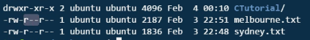
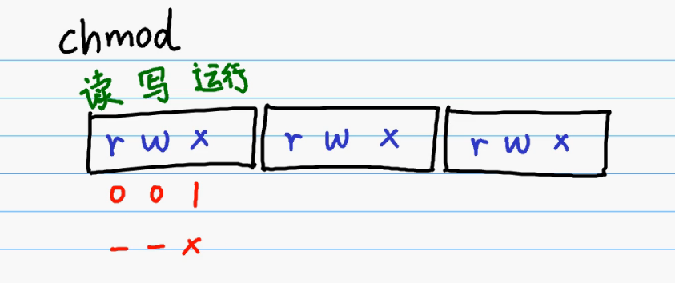

# Linux_1

## 1、入门常用命令

data:日期；

cal year  cal month year；查看日历

pwd:查看所在文件夹(print working directory)

cd:进入文件夹(change directory)

ls: 查看目录下文件夹 

ls -l: 查看文件夹详细信息  其中开心信息d：文件夹 -：文件

clear:屏幕清空

cd ..   退出当前文件夹，返回

mkdir: 当前位置创建文件夹

rmdir name/  ：删除name文件夹  /可有可无

cp rawfilename newfilename  ：复制文件到新文件

cat filename  :查看文件内容    capture

diff file1name file2name: 查看文件是否一样，无结果输出表示一致

head: 查看文件头，一个文本文件的前面几行的内容

head filename -n 7   :看前面7行

tail filename -n 5:看后面5行

wc filename:(word count) 查看行数 单词数 字符数

wc -w filename ：查看单词数w(word)

wc -l filename：查看行数l(line)

wc -c filename：查看字符数

### 文件操作

mv oldfilename newfilename: 将旧文件名改为新文件名

mv filename dirname/ ：将文件要移动到目标文件夹中

less filename ：文件内容太多时少量显示，可以按上下左右键移动，退出时按Q

linux文件 ls -l 显示三段分别表示u(user作者)、g(group小组成员)、o(others其他人)

每一段分别有三个字母rwx,r表示可读，w表示可写，x表示可运行，-表示不能



chmod u-r filename：去除作者的读权限

chmod u+r filename：增加作者的读权限

chmod go-r filename：去除小组和其他人的读权限

利用二进制：（命令中要转换成十进制）



chmod 444 filename:所有人都可读

grep:对文件内容进行搜索，利用正则表达式

grep content filename:在file中查找content

grep en filename:在file中有en的全部找出来

grep l* filename：找出file中含有0个1个或者多个l的

grep ll* filename：找出至少含一个l的

grep H filename: 找出含大写H的

grep ^H filename: 找出以大写H开头的

grep ^Ho filename: 找出以Ho开头的

grep H.ll filename：.表示任意字母Hill Hall等都可

grep [Hh]ill filename：[ ]表示里面是一个字母，可以匹配Hill、或hill

grep [A-Za-z]ill filename：找出任意字母+ill的

grep [A-Za-z]ill filename | wc：将左边内容放到wc中输出 行数单词数字符数

### Shell Script

\<、\> redirect 重定向符号

ls > 1.txt ：将ls的文件信息写到1.txt中

脚本：一堆的linux命令，写到一起打包成一个文件。linux中脚本文件以.sh结尾

```shell script
ls
cal
date
```

sh test.sh：运行脚本以sh开头


```shell script
a=10
echo $a
```

变量赋值的时候=左右两边不能加空格

变量在赋值时不能写$，当变量在输出或者其他运算在读取变量的时候必须加$

echo：输出

echo "Hello World" $a , 输出拼接直接打在后面,字符串可以不打双引号

```shell script
a=10
b=3
c=`expr $a + $b`
echo $c
```

expr：(expression)运算

把值存储在c中要用``将其括起来

```shell script
a=10
b=3
c=`expr $a \* $b`
echo $c
```

\*在shell中表示一个字符重复任意多次，要用\转义，+ - \\* /

公式里面一定要空空格  a + b，赋值时不能写空格a=10


条件判断：

```shell script
if [...]
then
else
fi
```

```shell script
a=35
b=5

if [ $a -gt $b ]
then
	echo $a
else
	echo $b
fi
```

判断大于小于

\> ：-gt  (greater than)

\< ：-lt   (less than)

≥ ：-ge (greater equal)

≤ ：-le (less equal)

= ：-eq

≠ ：-ne (not equal)


循环：

```shell script
for x in ...
do
	...
done
```

```shell script
a=35
b=5
for x in 1 2 3 4 5 6 7 8 9 10
do
	echo $x
done

#for x in {1..10}(不一定支持)
```

```sh
a=35
b=5
x=1
while [ $x  -le 10 ]
do
	echo $x
	x=`expr $x + 1`#x++
done
```


### shell 字符串操作

```sh
a="hello"
b="world"

echo $a $b#hello world  echo输出后面的格式
```

 

输入read

```
echo "Please enter a:"
read a
echo "Please enter b:"
read b
c=`expr $a + $b`
echo $c
echo $a + $b = $c
```

Bash脚本中的“["和"];"中括号是个语法标识符，前后一定要留空格。语句结束后也要写一个空格

比较字符串

```sh
Password="hello123"
echo "Please enter a password:"
read userPassword
if [ "$Password" = "$userPassword" ] #这里要有一个空格，比较字符串相等要用单等号，前后要有空格
#不等要用!=
then
	echo "密码正确！"
else
	echo "密码错误！"
fi
```

拼接字符串

```sh
str1="hello"
str2="world"
str3="$str1 $str2"
str4="$str1$str2"
echo $str3
echo $str4
```

判断字符串是否为空

```sh
str1=""
str2="world"
if [ -n $str1 ] #-n not zero不是空的  -z zero是空的
then echo "str1 is empty"
else
	echo "str1 is empty"
fi
```

如果要做文字处理，尽量用脚本语言，比c和java要快很多

### 数组

如果要处理数组要用bash 不能用sh

```bash
arr=( 7 8 9 10 ) #实测sh也可以使用数组，但还是尽量使用bash
#上面7和10前后也要有括号，注释和括号之间也要有括号
echo $arr #7
echo ${arr[1]} #8


for i in ${arr[@]} #遍历
do
	echo $i#i指的是每次数组里面的一个元素，i先等于7再i=8，走的时候元素本身而不是下标
	sum=`expr $sum + $i`
done
echo $sum
```

找最值

```sh
arr=( 7 8 9 110 1 2 4 )
max=${arr[0]}
for i in ${arr[@]}
do
	if [ $i -gt $max ]  #比较数字要用-gt
	then
		max=$i
    fi
done
echo $max
```


### 全局变量

表示在整个系统里都可以用到变量

USER  当前登录系统的用户的用户名

HOME  当前用户的主目录

```sh
cd $HOME
cd ~
#进入用户主目录
```

PATH  在变量中的地址可以直接运行程序

```sh
PATH=$PATH:/home/ubun/workspace  #程序所在目录
#运行之后PATH变量中增加了“/home/ubun/workspace ”
#添加到环境变量之后，任何地方都可以运行之前路径中的可执行文件
#linux不同变量之间用:隔开，window里面用;隔开
#修改PATH路径的时候一定要小心，不要把之前的删除！！
```

找到javac的可执行文件在哪，然后放到环境变量中即可。


### 压缩

```sh
yum -y install zip*
```

```sh
zip zipname.zip *   #压缩全部文件要zipname.zip
```

```sh
zip workspace.zip -r workspace/*   #-r表示把所有子文件夹的内容全部按层打包
#实测这里不加 是一样的效果
```

解压  unzip filename

```sh
#tar.gz  tar 

tar -zcvf test2.tar.gz test2.sh  #zxcvf顺序不固定
tar -zxvf test2.tar.gz
```

-z  使用gzip方法压缩

-c   create archive 创建目标

-x   解压用

-v 显示压缩过程

-f 重命名，给压缩文件起个名字

### 下载

```sh
wget URL

wget URL -O newname.tar.gz  #大写的欧  重命名
```

yum(选项)(参数)    **参考自**：http://lnmp.ailinux.net/yum

选项：

​	-h：显示帮助信息；

 	-y：对所有的提问都回答“yes”；
 	
 	-c：指定配置文件；
 	
 	-q：安静模式；
 	
 	-v：详细模式；

​	 -d：设置调试等级（0-10）； 

​	 -e：设置错误等级（0-10）；

​	 -R：设置yum处理一个命令的最大等待时间；

​	 -C：完全从缓存中运行，而不去下载或者更新任何头文件。

参数：

​	install：安装rpm软件包； 

​	update：更新rpm软件包； 

​	check-update：检查是否有可用的更新rpm软件包； 

​	remove：删除指定的rpm软件包； 

​	list：显示软件包的信息； 

​	search：检查软件包的信息； 

​	info：显示指定的rpm软件包的描述信息和概要信息； 

​	clean：清理yum过期的缓存； 

​	shell：进入yum的shell提示符； 

​	resolvedep：显示rpm软件包的依赖关系； 

​	localinstall：安装本地的rpm软件包； 

​	localupdate：显示本地rpm软件包进行更新； 

​	deplist：显示rpm软件包的所有依赖关系。

实例：

​	自动搜索最快镜像插件：yum install yum-fastestmirror

​	安装yum图形窗口插件：yum install yumex

​	查看可能批量安装的列表：yum grouplist

​	下载系统中没有的linux命令：yum -y install linuxcommand

安装：

​	yum install #全部安装 

​	yum install package1 #安装指定的安装包package1 

​	yum groupinsall group1 #安装程序组group1

更新和升级：

​	yum update #全部更新 

​	yum update package1 #更新指定程序包package1 

​	yum check-update #检查可更新的程序 

​	yum upgrade package1 #升级指定程序包package1 

​	yum groupupdate group1 #升级程序组group1

查找和显示：

​	yum info package1 #显示安装包信息package1 

​	yum list #显示所有已经安装和可以安装的程序包 

​	yum list package1 #显示指定程序包安装情况package1 

​	yum groupinfo group1 #显示程序组group1信息

​	yum search string 根据关键字string查找安装包

删除程序：

​	yum info package1 #显示安装包信息package1 

​	yum list #显示所有已经安装和可以安装的程序包 

​	yum list package1 #显示指定程序包安装情况package1 

​	yum groupinfo group1 #显示程序组group1信息

​	yum search string 根据关键字string查找安装包

清除缓存：

​	yum clean packages #清除缓存目录下的软件包 

​	yum clean headers #清除缓存目录下的 headers 

​	yum clean oldheaders #清除缓存目录下旧的 headers


# vim

编译：gcc test.c

生成可执行文件：gcc -o name test.c

执行；  ./name


编辑模式&命令模式

```sh
i INSERT

:wq code.c   #w表示保存  q表示退出

vim code.c   #再打开之前编写的文件

:syntax on/enable  #显示语法高亮

:set number   #显示行号

:q!  #不保存的情况下退出

vim ~/.vimrc   #.vimrc是vim的配置文件

#~/表示当前用户的根目录

#进入.vimrc后把语法高亮等操作放到vimrc去

#可以去github中找到其他人配置好的vimrc
```

#### 命令模式下

​	HJKL也可以当方向键使用：左下右上

​	W：跳到下一个单词，也可以按住w快速下移

​	B(back)：往回跳一个单词

​	PageUP PageDown 上下翻页

​	control +F(forward) =PageDown 向下翻页

​	control+B(baskward)=PageUp 向上翻页

​	88gg直接跳到88行

​	10j 往下十行

​	10k 往上十行

​	/Node 查找出所有Node并高亮，如果按N就会跳到Next个Node，按Shift+N表示上一个Node

​	cc 连按两次c，剪切光标所在行，cc之后自动进入编辑模式

​	u（undo）撤回刚才操作

​	c2c，连续剪切两行

​	p 粘贴剪切板中的内容到光标所在出

​	按yy(yank)进行复制当前行

​	按v进入visual模式，按下选中多行，按c，剪切多行

#### 代码自动补全

 	只能自动补全已经出现过的单词，control+N

#### 插件

vimplug

​		google github


### 之后的内容还没看，有关vim的插件，先看到这里了

# SSH

sudo apt-get install ssh

sudo service ssh start