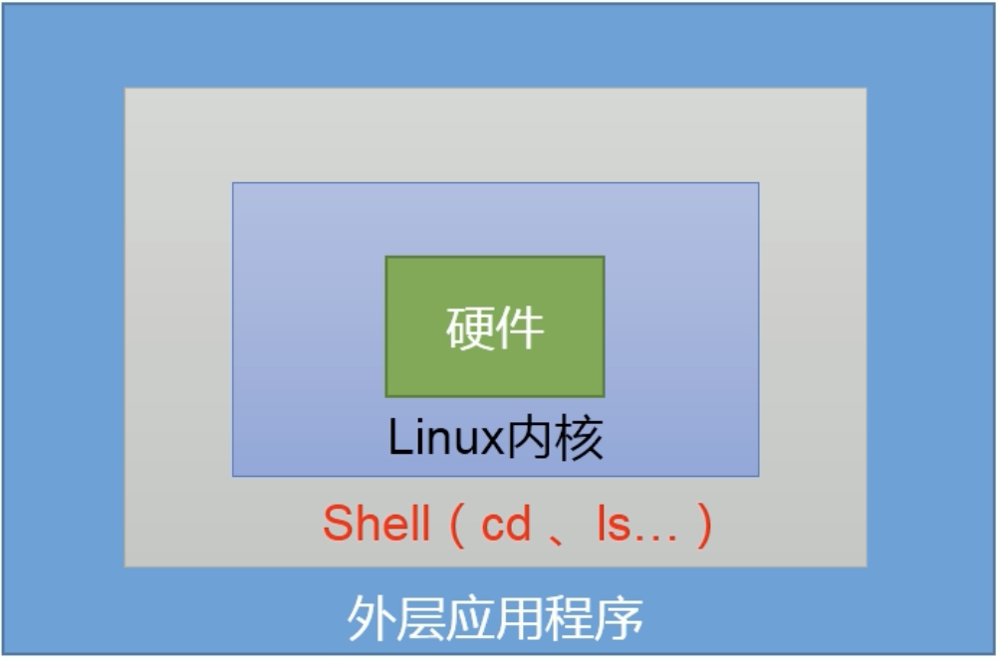
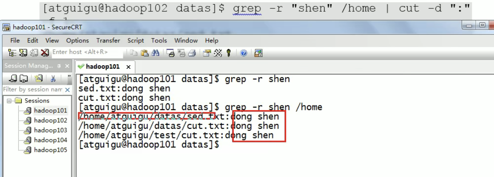

# Shell

Shell是一个命令行解释器，它接受应用程序、用户命令，然后调用操作系统内核。




## Shell 脚本入门

### 1.脚本格式

脚本以#!/bin/bash开头 指定解析器

### 2.helloworld

```bash
#!/bin/bash

echo "helloworld"
```

```shell
sh helloworld.sh   	自动获得执行权限 bash解析器帮你执行脚本
./helloworld.sh			需要执行权限
chmod 777 helloworld.sh
```

### 3.多命令处理

```bash
#!/bin/bash

cd /home/ogleede/
touch banzhang.txt
echo "I love cls" >> banzhang.txt
```

## Shell 中的变量

### 系统变量

#### 1.常用系统变量

$HOME, $PWD, $SHELL, $USER

### 自定义变量

#### 1.基本语法

> 定义变量：变量=值
>
> A=1   别空格
>
> echo $A

> 撤销变量：unset 变量

> 声明静态变量：readonly 变量=值，注意：不能unset

#### 2.变量定义规则

> 字母、数字和下划线组成，不能以数字开头，环境变量名建议大写

> 等号两侧不能有空格

> 在bash中，变量默认类型都是字符串类型，无法直接进行数值运算。

> 变量的值如果有空格，需要使用双引号或单引号括起来。

####  3.全局变量

```shell
export 变量名   将变量提升为全局变量
```

### 特殊变量

#### 1. $n

> n为数字，$0代表该脚本名称，$1-$9代表第1到第9个参数，十以上的参数需要用大括号包含，如${10}


#### 2. $#

> 获取所有输入参数个数，常用于循环


#### 3. $*、$@

$*  代表命令行中所有的参数，$*把所有的参数看成一个整体

$@ 代表命令行中所有的参数，不过$@把每个参数区分对待


#### 4. $?

最后一次执行的命令的返回状态。如果这个变量的值为0，证明上一个命令正确执行；如果这个变量的值为非0，则证明上一个命令执行错误。


## 运算符

1.基本语法

> "$((运算式))" 或 "$[运算式]"

> expr +,-,\\*,/,%		expr和运算符之间要有空格

```shell
expr 2 + 3   ->5
expr 2+3    ->2+3
expr 3 +2    error
expr `expr 3 + 2` \* 4    -> 20
s=$[(2+3)*4]
echo $s  ->20
```


## 条件判断

1.基本语法

[ condition ]   条件前后要有空格

条件非空即为true []返回false

2.常用判断比较

> 两个整数之间比较
>
> =  字符串比较
>
> -lt  小于 
>
> -le 小于等于
>
> -eq 等于
>
> -gt 大于（greater than）
>
> -ge 大于等于
>
> -ne 不等于


> 按照文件权限进行判断
>
> -r 有读的权限
>
> -w 有写的权限
>
> -x 有执行的权限


> 按照文件类型进行判断
>
> -f 文件存在并且是一个常规的文件
>
> -e 文件存在
>
> -d 文件存在并且是一个目录


用echo $? 得知上一步判断的结果

```shell
[ 23 -ge 22 ]
echo $?

[ -w helloworld.sh ]
echo $?
```

**多条件判断**

&& ||   短路效应

```shell
[ condition ] && echo OK || echo notok
```


## 流程控制

### if

1.基本语法

if [ conditon ];then

​	程序

fi

或者

if [ condition ]

​	then

​		程序

fi

if后要有空格，condition前后要有空格

if [ conditon ]

​	then

​		echo "11111"

elif [ condition ]

​	then

​		echo "22222"

fi

### case

1.基本语法

```bash
case $变量名 in
	"值1")
		如果变量的值=值1，则执行程序1
		;;
   "值2")
   	如果变量的值=值2，则执行程序2
   	;;
   省略其他分支
   *)
   	如果变量的值都不是以上的值，则执行此程序
;;
esac

```

case行尾必须为单次in，每一个模式匹配必须以右括号）结束

```bash
#!/bin/bash
case $1 in
1)
		echo "banzhang"
;;
2)
		echo "sss"
;;
*)
		echo "3333"
;;
esac
```


### for

1.基本语法1

```bash
for((初始值；循环控制条件；变量变化))
do
		程序
done
```

```bash
#!/bin/bash

for((i=1;i<=100;i++))
do
		s=$[$s+$i]
done
echo $s
```

基本语法2

```bash
for 变量 in 值1 值2 值3...
do
		程序
done
```

```bash
#!/bin/bash

for i in $*
do
		echo "banzhang xihuan $i"
done

for j in $@
do
		echo "banzhang xihuan $j"
done

for k in "$*"  #循环一次作为整体输出
do
		echo "banzhang xihuan $k"
done

for l in "$@"  #和原来一样，一次给一个
do
		echo "banzhang xihuan $l"
done
```


### while

1.基本语法

```bash
while [ conditon ]
do
	程序
done
```


```bash
s=0
i=1
while [ $i -le 100 ]
do
	s=$[$s + $i]
	i=$[$i + 1]
done

echo $s
```


## read读取控制台输入

1.基本语法

```bash
read(options)(arguments)
options:
	-p:指定读取值时的提示符；
	-t:指定读取值时的等待时间（秒）
arguments：
	变量：指定读取值时的变量名
```

```bash
#!/bin/bash

read -t 7 -p "Enter your name in 7 seconds " NAME
echo $NAME
```


## 函数

### 系统函数

1.basename 基本语法

```shell
basename [string/pathname][suffix]   删掉所有的前缀包括最后一个'/'字符，然后将字符串显示出来
options：
suffix为后缀，如果suffix被指定了，basename会将pathname或string中的suffix去掉

basename /home/ogleede/banzhang.txt
-> banzhang.txt
basename /home/ogleede/banzhang.txt .txt
-> banzhang
```

2.dirname 基本语法

```shell
dirname 文件绝对路径     从给定的包含绝对路径的文件名中去除文件名（非目录的部分），然后返回剩下的路径（目录的部分）
dirname /home/ogleede/banzhang.txt
-> /home/ogleede
```


### 自定义函数

1.基本语法

```bash
[ function ] funcname[()]
{
		Action;
		[return int;]  #一般用$?来判断返回值
}
funcname
```

> 必须在调用函数地方之前，先声明函数，shell脚本是逐行运行。不会先编译

> 函数返回值，只能通过$?系统变量获得，可以显示加：return返回，如果不加，将以最后一条命令运行结果，作为返回值，return后跟数值n（0-255）


```bash
#!/bin/bash

function sum()
{
		s=0;
		s=$[$1 + $2]
		echo $s
}

read -p "input your parameter1: " P1
read -p "input your parameter2: " P2

sum $P1 $P2
```


## Shell 工具

### cut

剪，在文件中负责剪切数据。cut命令从文件的每一行剪切字节、字符和字段并将这些字节、字符和字段输出。

1.基本用法

cut [options] filename 

说明：默认分隔符是制表符

-f：列号，提取第几列

-d：分隔符，按照指定分隔符分割列

```txt
dong shen
guan zhen
wo  wo
lai  lai
le  le
```

```shell
cut -d " " -f 1 cut.txt
dong
guan
wo
lai
le
```

```shell
cut -d " " -f 2,3 cut.txt
shen
zhen
 wo
 lai
 le
```

```shell
cat cut.txt | grep guan
-> guan zhen
cat cut.txt | grep guan | cut -d " " -f 1
-> guan
```

 ```shell
 #选取系统PATH变量值，第二个”：“开始后的所有路径
 echo $PATH | cut -d : -f 3-     3-表示第三列之后所有的
 ```

```shell
#切割ifconfig后打印的IP地址
ifconfig eth0 | grep "inet addr" | cut -d : -f 2 | cut -d " " -f 1
```


### sed

流编辑器，一次处理一行内容。处理时，把当前处理的行存储在临时缓冲区中，称为”模式空间“，接着用sed命令处理缓冲区中的内容，处理完成后，把缓冲区的内容送往屏幕。接着处理下一行，这样不断重复，直到文件末尾。文件内容并没有改变除非你使用重定向存储输出。

1.基本用法

sed [options] 'command' filename

options:

-e:直接在指令列模式上进行sed的动作编辑

commands：

a 新增，a的后面可以接字串，在下一行出现

d 删除

s 查找并替换


```sed.txt
dong shen
guan zhen
wo  wo
lai  lai

le  le
```


```shell
sed "2a mei nv" sed.txt
第二行后增加mei nv，原文件并没有改变，只是在打印的时候打的
```

```shell
删除sed.txt中包含有wo的行
sed "/wo/d" sed.txt
```

```shell
将文件中的wo替换为ni
sed "s/wo/ni/g" sed.txt    g表示全局,全部替换
```

```shell
将sed.txt文件中的第二行删除并将wo替换为ni
sed -e "2d" -e "s/wo/ni/g" sed.txt
```


### awk

一个强大的文本分析工具，把文件逐行的读入，以空格为默认分隔符将每行切开，切开的部分再进行分析处理

1.基本用法

```shell
awk [options] 'pattern{action1} pattern2{action2}...' filename
pattern: 表示awk在数据中查找的内容，就是匹配模式 #这里涉及到正则表达式了
action:在找到匹配内容时所执行的一系列命令
-options：
-F:指定输入文件拆分隔符
-v:赋值一个用户定义变量
```

```shell
搜索passwd文件以root关键字开头的所有行，并输出该行的第7列
awk -F : '/^root/ {print $7}' passwd
搜索passwd文件以root关键字开头的所有行，并输出该行的第1列和第7列，中间以”，“号分割。
awk -F : '/^root/ {print $1","$7}' passwd
只显示/etc/passwd的第一列和第七列，以逗号分割，且在所有行前面添加列名user，shell在最后一行添加”dahaige，/bin/zuishuai“。
awk -F : 'BEGIN{print "user,shell"} {print $1","$7} END{print "dahaige, /bin/zuishuai"}' passwd
将passwd文件中的用户id增加数值1并输出
awk -F : -v i=1 '{print $3+i}' passwd    这里记一下不用$i
```


awk的内置变量

```shell
FILENAME 文件名
NR			 已读的记录数
NF   		 浏览记录的域的个数（切割后，列的个数）
```

```shell
统计passwd文件名，每行的行号，每行的列号
awk -F : '{print FILENAME ","NR ","NF}' passwd
```


### sort


将文件进行排序，并将排序结果标准输出

基本语法：sort(options)(argument)

options:

```shell
-n 依照数值的大小排序  ASCII
-r 以相反的顺序来排序
-t 设置排序时所用的分隔字符
-k 指定需要排序的列
```

```shell
cut  -d 分割字符  awk  -F 分割字符  sort -t 分割字符  每个都不一样还真做到了
```

```shell
bb:40:5.4
bd:20:4.2
xz:50:2.3
cls:10:3.5
ss:30:1.6


sort -t : -nrk 2 sort.sh
```


## 面试真题

京东

```shell
使用Linux命令查询file1中空行所在的行号
awk '/^$/{print NR}' file1


文件chengji.txt：
张三 40
李四 50
王五 60

使用linux命令计算第二列的和并输出
cat chengji.txt | awk -F " " '{sum+=$2} END{print sum}'
```


搜狐

```shell
Shell脚本里如何检查一个文件是否存在？如果不存在该如何处理？
#!/bin/bash
if [ -f file.txt ]; then
	echo "exist!"
else
	echo "not exist!"
fi
```

sina

```shell
用shell写一个脚本，对文本中无序的一列数字排序
sort -n test.txt | awk '{a+=$0;print $0} END{print "SUM="a}'

```


```shell
请用shell脚本写出查找当前文件夹/home下所有的文本文件内容中包含有字符“shen”的文件名称
grep -r "shen" /home | cut -d ":" -f 1
```




