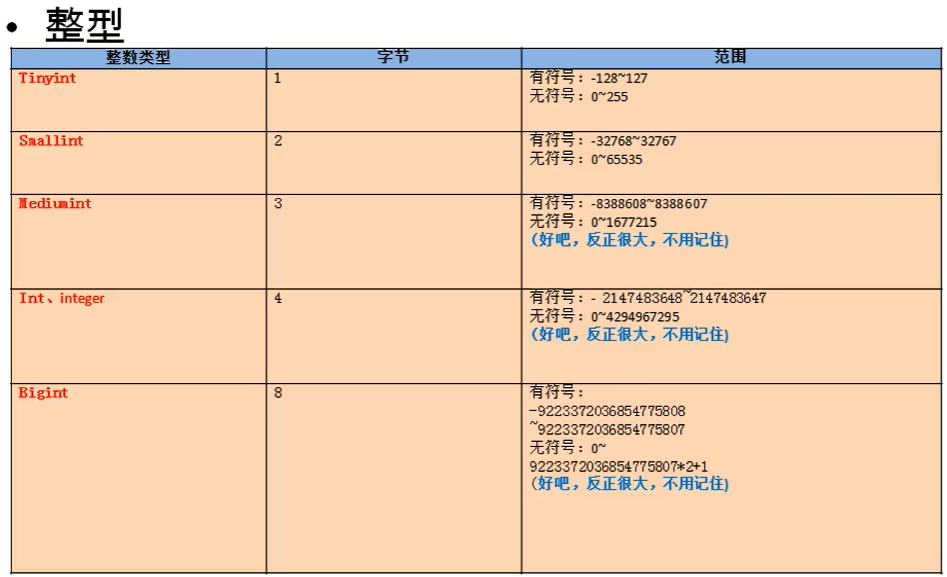

# 本单元目标

一、为什么要学习数据库	

二、数据库的相关概念      
		DBMS、DB、SQL
	三、数据库存储数据的特点
	四、初始MySQL
		MySQL产品的介绍        
		MySQL产品的安装          ★        
		MySQL服务的启动和停止     ★
		MySQL服务的登录和退出     ★      
		MySQL的常见命令和语法规范      
	五、DQL语言的学习   ★              
		基础查询        ★             
		条件查询  	   ★			
		排序查询  	   ★				
		常见函数        ★               
		分组函数        ★              
		分组查询		   ★			
		连接查询	 	★			
		子查询       √                  
		分页查询       ★              
		union联合查询	√			
	六、DML语言的学习    ★             
		插入语句						
		修改语句						
		删除语句						
	七、DDL语言的学习  
		库和表的管理	 √				
		常见数据类型介绍  √          
		常见约束  	  √			
	八、TCL语言的学习
		事务和事务处理                 
	九、视图的讲解           √
	十、变量                      
	十一、存储过程和函数   
	十二、流程控制结构    

## 前言

#### 数据库的好处

​	1.持久化数据到本地
​	2.可以实现结构化查询，方便管理

#### 数据库相关概念

​	1、DB：数据库，保存一组有组织的数据的容器
​	2、DBMS：数据库管理系统，又称为数据库软件（产品），用于管理DB中的数据
​	3、SQL:结构化查询语言，用于和DBMS通信的语言

#### 数据库存储数据的特点

​	1、将数据放到表中，表再放到库中
​	2、一个数据库中可以有多个表，每个表都有一个的名字，用来标识自己。表名具有唯一性。
​	3、表具有一些特性，这些特性定义了数据在表中如何存储，类似java中 “类”的设计。
​	4、表由列组成，我们也称为字段。所有表都是由一个或多个列组成的，每一列类似java 中的”属性”
​	5、表中的数据是按行存储的，每一行类似于java中的“对象”。

#### MySQL产品的介绍和安装

##### MySQL服务的启动和停止

​	方式一：计算机——右击管理——服务
​	方式二：通过管理员身份运行
​	net start 服务名（启动服务）
​	net stop 服务名（停止服务）

##### MySQL服务的登录和退出   

​	方式一：通过mysql自带的客户端
​	只限于root用户

	方式二：通过windows自带的客户端
	登录：
	mysql 【-h主机名 -P端口号 】-u用户名 -p密码
	
	退出：
	exit或ctrl+C

##### MySQL的常见命令

```sql
1.查看当前所有的数据库
show databases;
2.打开指定的库
use 库名
3.查看当前库的所有表
show tables;
4.查看其它库的所有表
show tables from 库名;
5.创建表
create table 表名(

	列名 列类型,
	列名 列类型，
	。。。
);
6.查看表结构
desc 表名;
7.查看服务器的版本
方式一：登录到mysql服务端
select version();
方式二：没有登录到mysql服务端
mysql --version
或
mysql --V
```

##### MySQL的语法规范

​	1.不区分大小写,但建议关键字大写，表名、列名小写
​	2.每条命令最好用分号结尾
​	3.每条命令根据需要，可以进行缩进 或换行
​	4.注释
​		单行注释：#注释文字
​		单行注释：-- 注释文字
​		多行注释：/* 注释文字  */

##### SQL的语言分类

​	DQL（Data Query Language）：数据查询语言
​		select 
​	DML(Data Manipulate Language):数据操作语言
​		insert 、update、delete
​	DDL（Data Define Language）：数据定义语言
​		create、drop、alter
​	TCL（Transaction Control Language）：事务控制语言
​		commit、rollback

##### SQL的常见命令

	show databases； 查看所有的数据库
	use 库名； 打开指定 的库
	show tables ; 显示库中的所有表
	show tables from 库名;显示指定库中的所有表
	create table 表名(
		字段名 字段类型,	
		字段名 字段类型
	); 创建表
	
	desc 表名; 查看指定表的结构
	select * from 表名;显示表中的所有数据


## DQL语言的学习

### 进阶1：基础查询

#### 语法：

```
SELECT 要查询的东西
FROM 表名;
```

```
类似于Java中 :System.out.println(要打印的东西);
特点：
①通过select查询完的结果 ，是一个虚拟的表格，不是真实存在
②要查询的东西 可以是常量值、可以是表达式、可以是字段、可以是函数
```

##### 查询多个字段：

```
select last_name,salary,email from employees;

select * from employees;
```

##### 查询常量值：

```
select 100;
select 'jogn';
```

##### 查询表达式

```
select 100%98；
```

##### 查询函数

```
select version();#查询返回值
```

##### 起别名

```
select 100%98 as 结果；
select last_name AS 姓, first_name AS 名 from employees；
select last_name 姓,first_name 名 from employees；#空格
select salary as "out put" from employees;#别名中有特殊符号 空格 out # 等需要双引
```

##### 去重

```
select DISTINCT department_id from employees;
```

##### +号的作用

mysql中+只有运算符号的作用

```
select 100+90;#两个操作数都为数值型，则做加法运算
select '123'+90;其中一方为字符型，试图将字符型数值转换成数值型，如果转换成功，则继续做加法运算
select 'john'+90;如果转换失败，则将字符型数值转换成0；
select null+10;只要其中一方为null，则结果肯定为null；
```

##### 连接符CONCAT

```sql
select CONCAT('a','b','c') AS 结果 from employees;
```

##### IFNULL

```
select ifnull(commission_pct,0) AS 奖金率, commission_pct from employees;
#如果commission为null则替换为0
```

##### 格式化：

选中F12

##### 着重号：

表名等于关键字冲突用``着重号包起来


### 进阶2：条件查询

​	**条件查询**：根据条件过滤原始表的数据，查询到想要的数据

#### 	语法：

```
select 
		要查询的字段|表达式|常量值|函数
from 
		表
where 
		条件 ;
```

```sql
分类：
一、按条件表达式筛选
	示例：salary>10000
	条件运算符：
	> < >= <= = != <>(-ne)

二、按逻辑表达式筛选
&& || !
and or not <-推荐
示例：salary>10000 && salary<20000

三、模糊查询
like
between and
in
is null
示例：last_name like 'a%'
```

##### 按条件表达式筛选

```sql
select
	*
from
	employees
where
	salary>12000;
```

##### 按逻辑表达式筛选

```sql
select
	last_name,
	salary,
	commission_pct
from
	employees
where
	salary>=10000 AND salary<=20000;
```

##### 模糊查询

like：一般和通配符搭配使用

​			通配符：

​					%  任意多个字符，包含0个字符

​					_   任意单个字符

between and:

​			可以提高语句简洁度；

​			包含临界值；

​			两个临界值不能调换顺序，前小后大

in：

​			用于判断某字段的值是否属于in列表中的某一项；

​			使用in提高语句简洁度；

​			in列表的值类型必须统一或兼容;

​			in列表内不支持通配符

is null | is not null：

​			=或<>不能用于判断null值

​			is null或 is not null 可以判断null

​			不能判断其他值

```sql
like：

#查询员工名中包含字符a的员工信息
select * from employees where last_name LIKE '%a%';

#查询第三个字符为e，第五个字符为a的员工名和工资
select last_name,salary from employees where last_name LIKE '__e_a%';

#查询员工名第二个字符为_的员工名
select last_name from employees where last_name like '_\_%';

#指定任意转义符号
select last_name from employees where last_name like '_$_%' escape $;

#查询员工表的job_id中包含a和e的，并且a在e的前面
select job_id
from employees
where job_id like '%a%e%';
```

```sql
between and :
#查询员工编号在100-120之间的员工信息
select * from employees where employee_id >=100 and employee_id <=120;
select * from employees between 100 and 120;

#查询不在范围内的
select last_name,salary
from employees
where salary not between 8000 and 10000;
```

```sql
in：
#查询工种编号是IT_PROG\AD_VP\AD_PRES中的一个员工名和工种编号
select last_name,job_id from employees where job_id = 'IT_PROG' 
or job_id = 'AD_VP' or job_id = 'AD_PRES';
select last_name,job_id from employees where job_id in ('IT_PROG','AD_VP','AD_PRES');
```

```sql
is null
#查询没有奖金近的员工名和奖金率
select last_name,commission_pct from employees where commission_pct is null;
#不能用=判断是否为null
select last_name,commission_pct from employees where commission_pct is not null;
```

##### 安全等于

<=>

is null 仅可以判断null值

<=> 既可以判断null，也可以判断其他值

```sql
select last_name,commission_pct from employees where commission_pct <=> null;
select last_name,commission_pct from employees where salary <=> 12000;

```

```sql
#查询员工号为176的员工的姓名和部门号和年薪
SELECT
	last_name,
	department_id,
	salary*12*(1+ifnull(commission_pct,0)) AS 年薪
FROM
	employees;
```

##### 面试题

```sql
#试问： select * from employees; 
#和	select * from  employees where commission_pct like '%%' and last_name like '%%';
#结果是否一样
#################################
#不一样，如果判断的字段有null则不行。
```


### 进阶3：排序查询

#### 语法：

	select
		要查询的东西
	from
		表
	where 
		条件
	
	order by 排序的字段|表达式|函数|别名 【asc|desc】

##### 	特点：

​			省略自动为asc；

​			order by子句可以支持单个字段 、多个字段、表达式、函数、别名

​			order by 子句一般放在查询语句的最后面，limit子句除外

```sql
select * from employees order by salary desc;
select * from employees order by salary asc;#可以省略asc
```

##### 目前的执行顺序

先from、再where、然后select、最后order by

##### 按表达式排序

```sql
#按年薪高低显示员工的信息和年薪
select *,salary*12*(1+ifnull(commission_pct,0)) as 年薪
from employees 
order by salary*12*(1+ifnull(commission_pct,0)) desc;

#支持别名
select *,salary*12*(1+ifnull(commission_pct,0)) as 年薪
from employees 
order by 年薪 desc;

#按函数排序
select LENGTH(last_name) as 字节长度 , last_name,salary
from employees
order by LENGTH(last_name) desc;

#查询员工信息，要求先按工资排序，再按员工编号排序[按多个字段排序]
select *
from employees
order by salary asc,employee_id desc; #工资相同的再按员工号排序
```


### 进阶4：常见函数

#### 	一、单行函数(做处理)

##### 1、字符函数

```sql
	concat  #拼接
	substr  #截取子串
	
	select substr('李莫愁爱上了陆展元',7);#索引从1开始，截取索引后面的字符
	select substr('李莫愁爱上了陆展元',1,3);#截取从指定索引处，指定字符长度的字符
	
	instr   #返回子串第一次出现的索引，找不到返回0
	
	select instr('杨不悔爱上了殷六侠','殷六侠');
	
	upper   #转换成大写
	lower   #转换成小写
	trim    #去前后指定的空格和字符
	
	select trim('   aaa    ');#aaa
	select trim('a' from'aaaaaaaaa111aa111aaaaaa');#111aa111
	
	ltrim   #去左边空格
	rtrim   #去右边空格
	replace #替换
	
	select replace('周芷若张无忌爱上了周芷若','周芷若','赵敏');#赵敏张无忌爱上了赵敏
	
	lpad    #左填充
	
	select lpad('殷素素',10,'*');#*******殷素素，总长度为10
	select lpad('殷素素',2,'*');#*******殷素，总长度为2，右截断
	select rpad('123',2,'*');#12右截断
	
	rpad    #右填充
	length  #获取字节个数（与字符集有关）#SHOW VARIABLES LIKE '%char%';
```

##### 2、数学函数

```sql
	round    #四舍五入
	
	select round(-1.55);#-2
	select round(1.567,2);#1.57
	
	rand     #随机数
	floor    #向下取整
	ceil     #向上取整
	mod      #取余
	
	###mod(a,b): a-a/b*b; 除法取整
	select mod(10,3);#1
	select mod(-10,3);#-1
	select mod(-10,-3);#-1
	
	truncate #截断
	
	select truncate(1.65,1);#1.6
```

##### 3、日期函数

```sql
#	now()       #当前系统日期+时间
#	curdate()   #当前系统日期
#	curtime()   #当前系统时间

select YEAR(NOW()) as 年;
select YEAR('1998-1-1') as 年;
select YEAR(hiredate) as 年 
from employees;
select MONTH(NOW()) as 月;
select MONTHNAME(NOW()) as 月;

#	str_to_date ('9-13-1999','%m-%d-%y')#将字符转换成日期

#查询入职日期为1992-4-3的员工信息
select * from employees where hiredatae = '1992-4-3';
select * from employees where hiredate = STR_TO_DATE('4-3 1992','%c-%d %Y');

#	date_format('2018/6/6','%Y年%m月%d日'); #将日期转换成字符

select DATE_FORMAT(NOW(),'%y年%m月%d日');
```


##### 4、流程控制函数

```sql
#	if #处理双分支
select IF(10<5,'big','small');#类似三元运算符的逻辑

#	case#语句 处理多分支
#		#情况1：处理等值判断
#		#情况2：处理条件判断

case 要判断的字段或表达式
when 常量1 then 要显示的值1或语句1；(不使用select时用语句，搭配select时要用值)
when 常量2 then 要显示的值2或语句2；
...
else 要显示的值n或语句n;（默认情况，java中的default）
end

######################情况1，处理等值判断
#查询员工的工资，要求
#部门号=30，显示的工资为1.1倍
#部门号=40，显示的工资为1.2倍
#部门号=50，显示的工资为1.3倍
#其他部门，显示的工资为原工资
select salary as 原始工资,department_id,
case department_id
when 30 then salary*1.1
when 40 then salary*1.2
when 50 then salary*1.3
else salary
end as 新工资
from employees;

##########################情况2 多重if
#查询员工的工资情况
#如果工资>20000，显示A级别
#如果工资>15000,显示B级别
#如果工资>10000，显示C级别

select salary,
case
when salary>20000 then 'A';
when salary>15000 then 'B';
when salary>10000 then 'C';
else 'D';
end as 工资级别
from employees;
```

##### 5、其他函数

```sql
	version()	#版本
	database()	#当前库,当前库没有s
	user()		#当前连接用户
```


​	

#### 二、分组函数（做统计聚合）


```sql
	sum   #求和
	max   #最大值
	min   #最小值
	avg   #平均值
	count #计数(统计非空的值的个数)

	特点：
	1、以上五个分组函数都忽略null值，除了count(*)
	2、sum和avg一般用于处理数值型
		max、min、count可以处理任何数据类型
    3、都可以搭配distinct使用，用于统计去重后的结果
    
    select sum(distinct salary )from employees;
    
	4、count的参数可以支持：
		字段、*、常量值，一般放1

	   建议使用 count(*)，统计行数
	   select count(1) from employees;
	   #新增一列全是1，统计行数
	   
	   效率：
	   MYISAM 存储引擎下，count(*)的效率高
	   INNODB 存储引擎下，count(*)和count(1)效率差不多，比count(字段)要高一些（这里要判断字段是否为null）
	   
	   5、和分组函数一同查询的字段最好是分组后的字段，
	   group by 后的字段，不然输出维度不一致造成混淆
```

```sql
#查询员工表中的最大入职时间和最小入职时间的相差天数
#用到了新函数 datediff('2017-10-1','2017-9-29');返回差值
select datediff(max(hiredate),min(hiredate));

#查询部门编号为90的员工个数
select count(*)
from employees
where department_id = 90;
```


### 进阶5：分组查询

#### 	语法:

```sql
#引入：查询每个部门的平均工资

select 查询的字段，分组函数
from 表
[where condition]
group by 分组的字段
[order by column]

#查询列表比较特殊，要求是分组函数和group by后出现的字段

#查询每个工种的最高工资
select max(salary),job_id
from employees
group by job_id;

#查询每个位置上的部门个数
select count(*),location_id
from departments
group by location_id;

#查询邮箱中包含a字符的，每个部门的平均工资
select AVG(salary),department_id
from employees
where email like '%a%'
group by department_id;

#查询有奖金的每个领导手下员工的最高工资
select max(salary),manager_id
from employees
where commission_pct is not null
group by manager_id;

#查询哪个部门的员工个数>2
#1.查询每个部门的员工个数
select count(*),department_id
from employees
group by department_id;

#2.根据1.的结果进行筛选，查询哪个部门的员工个数>2
select count(*),department_id
from employees
group by department_id
HAVING count(*)>2;
#####having 关键字使用分组后的数据

#查询每个工种有奖金的员工的最高工资>12000的工种编号和最高工资
#1.查询每个工种有奖金的员工的最高工资
select MAX(salary),job_id
from employees
where commission_pct is not null
group by job_id;

#2.筛选最高工资
select MAX(salary),job_id
from employees
where commission_pct is not null
group by job_id;
having MAX(salary)>12000;
####先看查谁，分组依据，分组前还是分组后

#查询领导编号>102的每个领导手下的最低工资>5000的领导编号是哪个，以及其最低工资
select MIN(salary),manager_id
from employees
where manager_id>102
group by manager_id
having MIN(salary)>5000;
########原始表中有的是where，没有的用having
```

##### 特点：

```sql
1、可以按单个字段分组，可以是表达式
#######2、和分组函数一同查询的字段最好是分组后的字段，保证维度一致####################
3、分组筛选
			针对的表		位置			关键字
分组前筛选：	原始表		  group by的前面      where
分组后筛选：	分组后的结果集	group by的后面		having

######分组函数做条件肯定是放在 having 子句中#########
######优先考虑使用分组前筛选，性能高#########

4、可以按多个字段分组，字段之间用逗号隔开(相同选择的分组)

#查询每个部门每个工种的员工的平均工资
select AVG(salary),department_id,job_id
from employees
group by department_id,job_id;
###取分组的组合，都一样才是一个组，与顺序无关####

5、可以支持排序

#查询每个部门每个工种的员工的平均工资，并按平均工资高低显示
select AVG(salary),department_id,job_id
from employees
group by department_id,job_id;
order by AVG(salary) desc;

6、 having后可以支持别名， group by 后面也可以别名
#####oracle数据库 having和 group by后面不支持别名###
```


### 进阶6：多表连接查询

#### 用途

```sql
当用到多个表时，用到多表连接查询

笛卡尔乘积：如果连接条件省略或无效则会出现
select name ,boyName from beauty,boys;
会遍历第一张表的元素对应第二张表，输出为 count * count

解决办法：添加上连接条件
select name,boyname from boys,beauty
where beauty.boyfriend_id=boys.id;
```

#### 分类

```sql
按年代分类：
	sql92标准：mysql中仅支持内连接
	sql99标准：mysql中不支持全外连接
	
按功能分类：
	内连接：
			等值连接
			非等值连接
			自连接
	外连接：
			左外连接
			右外连接
			全外连接
	交叉连接
```

#### 一、sql92标准

##### 1.等值连接

```sql
#查询女神名和对应的男神名
select `name`,boyName
from boys,beauty
where beauty.boyfriend_id=boys.id;

#查询员工名和对应的部门名
select last_name,department_name
from employees,departments
where employees.department_id=departments.department_id;

#为表起别名，在用表名去做限定时，起短的别名更简洁
#查询员工名、工种号、工种名
select last_name,e.job_id,job_title
from employees as e,jobs as j
where e.job_id=j.job_id;
#####注意是先走from，select中的表名也要用别名，不然报错##

###在 where的基础上再加筛选
#查询有奖金的部门名，员工名
select last_name,department_name,commission_pct
from employees e,departments d
where e.department_id=d.department_id
and e.commission_pct is not null;

###加分组
#查询每个城市的部门个数
select count(*) 个数,city
from departments d,locations l#相当于合成一个大表
where d.location_id=l.location_id
group by city;

#查询有奖金的每个部门的部门名和部门的领导编号和该部门的最低工资
select department_name,d.manager_id,MIN(salary)
from departments d,employees e
where d.department_id=e.department_id
and commission_pct is not null
group by d.department_id,d.manager_id;
###部门ID和经理ID不是一一对应的，取交集
###部门id和部门name是一一对应的，根据执行顺序，where紧跟着from，所以新的大表中部门id相同的放到一起了，而部门id和部门name是一一对应的，分组可选不同组的id和不同组的name均可。

#加排序
#查询每个工种的工种名和员工的个数，并按员工个数降序排列
select job_title,count(*)
from jobs j,employees e
where j.job_id=e.job_id
group by job_title
order by count(*) desc;

#三表连接
#查询员工名、部门名和所在的城市
select last_name,department_name,city
from employees e,departments d, locations l
where e.department_id=d.department_id
and d.location_id=l.location_id;
```

```sql
##等值连接特点：
1.多表等值连接的结果为多表的交集部分####
2.n表连接，至少需要n-1个链接条件####
3.多表的顺序没有要求
4.一般需要为表取别名
```

##### 2.非等值连接

```sql
#查询员工的工资和工资级别
select salary,grade_level
from employees e,job_grades g
where salary between g.lowest_sal and g.highest_sal;
```

##### 3.自连接

```sql
#查询员工名和上级的名称（找员工名对应的manager_id，再通过和当前表的employees_id相等找到对应的manager_name）
select e.employees_id,e.last_name,m.employee_id,m.last_name
from employees e,employees m
where e.manager_id=m.employee_id########
###相当于把一张表当成两张表
```

#### 二、sql99标准

##### 语法与重点

```sql
#语法：
select 查询列表
from 表1 别名[连接类型]（jointape)##看是哪种连接
join 表2 别名 
on 连接条件
[where 筛选条件]
[group by]
[having]
[order by]
```

```sql
内连接**  inner
外连接
	左外** left[outer]
	右外** right[outer]
	全外	 full[outer]
交叉连接    cross
```

##### 1.内连接

```sql
#1.1等值连接
#查询员工名、部门名
select last_name,department_name
from employees e 
inner join departments d
on e.department_id=d.department_id;

#查询名字中包含e的员工名和工种名
select last_name,job_title
from employees e
inner join jobs j
on e.job_id=j.job_id
where last_name like '%e%';

#查询部门个数>3的城市名和部门个数
select city,count(*)
from locations l
inner join departments d
on l.location_id=d.location_id 
group by city
having count(*)>3;

#查询哪个部门的员工个数>3的部门名和员工个数，并按个数降序
select department_name,count(*)
from departments d
inner join employees e
on d.department_id=e.department_id
group by d.department_id
having count(*)>3
order by count(*) desc;

#查询员工名、部门名、工种名，并按部门名降序
select last_name,department_name,job_title
from employees e
inner join departments d on d.department_id=e.department_id
inner join jobs j on e.job_id=j.job_id
order by department_name desc;
###多表连接要注意顺序保证按顺序都有连接条件####
```

```sql
#特点
#inner 可以省略
#筛选条件放在where后面，连接条件放在on后面，提高分离性
#等值连接和92相同，都是查询多表的交集
```


```sql
#1.2非等值连接
#查询员工的工资级别
select salary,grade_level
from employees e
join job_grades g
on e.salary between g.lowest_sal and g.highest_sal;
```


```sql
#1.3自连接
#查询员工的名字、上级的名字
select e.last_name,m.last_name
from employees e
join employees m
on e.manager_id=m.employee_id;
```


##### 2.外连接

​	**应用场景**：查询一个表中有，另一个表中没有的数据，非交集显示null，用一个主表去匹配从表中的内容

​	特点：

1.外连接的查询结果为主表中的所有记录

​			如果从表中有和他匹配的，则显示匹配的值

​			如果从表中无和他匹配的，则显示null

 	外连接查询结果=内连接结果+主表中有而从表没有的记录

2.左外连接，left join 左边的是主表

  右外连接，right join右边的是主表

3.左外和右外交换两个表的顺序，可以实现同样的效果

4.全外连接=内连接的结果+表1中有但表2没有的+表2中有但表1没有的

```sql
#引入：查询男朋友   不在男神表的女神名

select b.name,bo.*
from beauty b
left outer join boys bo
on b.boyfriend_id = bo.id
where bo.id is null;
####如果想查询非交集值，即null值，这时筛选条件要选择主键，因为主键规定必须非空非null########

select b.name,bo.*
from boys bo
right outer join beauty b
on b.boyfriend_id = bo.id
where bo.id is null;

###反着写出来的是对象匹配的######
SELECT b.*, bo.*
FROM boys bo
LEFT OUTER JOIN beauty b
ON b.`boyfriend_id`=bo.`id`;
```


```sql
#查询哪个部门没有员工
#左外
select d.*,e.employee_id
from departments d
left join employees e
on d.department_id=e.department_id
where e.employee_id is null;
```


**全外连接**

#mysql不支持

#全外连接=内连接的结果+表1中有但表2没有的+表2中有但表1没有的

```sql
use girls;
select b.*,bo.*
from beuty b
full outer join boys bo
on b.boyfriend_id=bo.id;
```

**交叉连接**

```sql
#交叉连接即为笛卡尔积的99写法
select b.*,bo.*
from beauty b
cross join boys bo;
```

#### 三、连接总结


**一道习题，关于内外连接的选择**

```sql
#查询部门名为SAL或IT的员工信息
#内连接
SELECT e.*,d.`department_name`,d.`department_id`
FROM departments d
INNER JOIN employees e
ON d.`department_id`=e.`employee_id`
WHERE d.`department_name` IN ('SAL','IT');
```


```sql
#外连接
SELECT e.*,d.`department_name`,d.`department_id`
FROM departments d
LEFT OUTER JOIN employees e
ON d.`department_id`=e.`department_id`
WHERE d.`department_name` IN ('SAL','IT');
```


**多出来的null值为主表中的信息，如果查询想找到所有符合条件的，但可能为null的用外连接**


### 进阶7：子查询

#### 含义&分类

```sql
#出现在其他语句中的 select语句，称为子查询或内查询
#外部的查询语句，称为主查询或外查询


```

**外面的语句可以是insert,update,delete,select等，一般select作为外面语句较多**

```sql
按子查询出现的位置：
	select 后面
		：仅仅支持标量子查询
	from 后面
		：支持表子查询
	where 或 having 后面  ★
		：支持标量子查询	★(单行)
			 列子查询	   ★（多行）
			 行子查询
	exists 后面（相关子查询）
		：支持表子查询
按结果集的行列数不同：
	标量子查询（结果集只有一行一列）
	列子查询（结果集只有一列多行）
	行子查询（结果集可以有一行多列）
	表子查询（结果集一般为多行多列）
```


#### 一、where或having后面★

##### 特点

​	1、子查询放在小括号内

​	2、子查询一般放在条件的右侧

​	3、标量子查询，一般搭配着单行操作符使用

​			>    <    >=   <=   =   <>

​		 列子查询，一般搭配着多行操作符使用

​			in, any/some,all

​	4、子查询执行优先于主查询执行

##### 1、标量子查询（单行子查询）★

```sql
#查询谁的工资比Abel高

#1查询Abel的工资
select salary
from employees
where last_name='Abel';

#2查询员工信息，满足salary>1中结果
select *
from employees
where salary>(
		select salary
		from employees
		where last_name='Abel'
);
```

```sql
#返回job_id与141号员工相同，salary比143号员工多的员工 姓名，job_id和工资
select last_name,job_id,salary
from employees
where job_id=(
		select job_id
    	from employees
    	where employee_id=141
)
and salary>(
		select salary
    	from employees
    	where employee_id=143
);
```

```sql
#查询最低工资大于50号部门最低工资的部门id和其最低工资
#1查询50号部门的最低工资
select min(salary)
from employees
where department_id=50

#2 查询每个部门的最低工资
select min(salary),department_id
from employees
group by department_id

#3筛选2，满足min(salary)>1

select min(salary),department_id
from employees
group by department_id
having min(salary)>(
	select min(salary)
	from employees
	where department_id=50
)

```

​	**非法使用标量子查询情况**

   	1、单行操作符搭配非标量子查询
   	
   	2、子查询结果为空，总结起来就是子查询结果不是一行一列的

##### 2、列子查询（多行子查询）★


```sql
#返回location_id是1400或1700的部门中的所有员工姓名
select last_name
from employees
where department_id in(
	select distinct department_id##如果有重复要去重，只是要值
    from departments
    where location_id =1400
    or location_id=1700
)

#用=any替换in
select last_name
from employees
where department_id =any(
	select distinct department_id##如果有重复要去重，只是要值
    from departments
    where location_id =1400
    or location_id=1700
)
#用<>all替换not in

```

```sql
#返回其他工种中比job_id为IT_PROG部门任一工资低的员工的员工号、姓名、job_id以及salary
#1
select distinct salary 
from employees
where job_id ='IT_PROG'

#2
select last_name,employee_id,job_id,salary
from employees
where salary<any(
    select distinct salary 
    from employees
    where job_id ='IT_PROG'
)and job_id<>'IT_PROG';

#不用any(any其实是某一个的意思)
select last_name,employee_id,job_id,salary
from employees
where salary<(
    select max(salary) 
    from employees
    where job_id ='IT_PROG'
)and job_id<>'IT_PROG';

```


##### 3、行子查询（多列多行，或一行多列）

```sql
#查询员工编号最小并且工资最高的员工信息
select *
from employees
where employee_id=(
	select min(employee_id)
    from employees
)and salary=(
	select max(salary)
    from employees
);

#用行子查询代替
select *
from employees
where (employee_id,salary)=(
	select min(employee_id),max(salary)
    from employees
)
###筛选条件使用同样的操作符时可以使用这种方法####
```

#### 二、select后面

```sql
####仅支持标量子查询##########
# 查询每个部门的员工个数
select d.*,(
	select count(*)
    from employees e
    where e.department_id=d.department_id
)
from departments d;

###这里用外连接分组的话，一些没有员工的部门信息就无法显示出来了。（比如信息中有null值，manager_id)
```

```sql
#查询员工号=102的部门名
select (
	select department_name
    from departments s
    inner join employees e
    on d.department_id=e.department_id    
)
```


#### 三、from后面

**将子查询结果充当结果表，必须起别名**

```sql
#查询每个部门的平均工资的工资等级
#1
select AVG(salary),department_id
from employees
group by department_id

#2连接1的结果表和job_grades表，筛选条件平均工资 between lowest_sal and highest_sal

select ag_dep.*,g.grade_level
from (
	select AVG(salary) ag,department_id
	from employees
	group by department_id
) ag_dep
inner join job_grades g
on ag_dep.ag between lowest_sal and highest_sal

#查询各部门中工资比本部门平均工资高的员工的员工号，姓名和工资
#1查询各部门的平均工资
select AVG(salary),department_id
from employees
group by department_id

#2连接1结果集和employees表，进行筛选
select employee_id,last_name,salary,e.department_id
from employees e
inner join(
	select AVG(salary) ag,department_id
    from employees
    group by department_id
) ag_dep
on e.department_id=ag_dep.department_id
where salary>ag_dep.ag;
```


#### exists 后面（相关子查询）

```sql
语法：exists(完整的查询语句)
结果1或0
```

```sql
#查询有员工的部门名
select department_name
from departments d
where exists(
	select *
    from employees e
    where d.department_id=e.department_id
)

#in
select department_name
from departments d
where d.department_id in(
	select department_id
    from employees
)
```

```sql
#查询没有女朋友的男神信息
#in
select bo.*
from boys bo
where bo.id not in(
	select boyfriend_id
    from beauty
)

#exists
select bo.*
from boys bo
where not exists(
	select boyfriend_id
    from beauty b
    where bo.id=b.boyfriend_id
)
```


```sql
#查询各部门中工资比本部门平均工资高的员工的员工号，姓名和工资
#1查询各部门的平均工资
select AVG(salary),department_id
from employees
group by department_id

#2连接1结果集和employees表，进行筛选
select employee_id,last_name,salary,e.department_id
from employees e
inner join(
	select AVG(salary) ag,departmeng_id
    from employees
    group by department_id
) ag_dep
on e.department_id=ag_dep.department_id
where salary>ag_dep.ag;
```


### 进阶8：分页查询

**应用场景**：

```sql
当要显示的数据，一页显示不全，需要分页提交sql请求
```

**语法**：

```sql
select 字段|表达式,...
from 表1
【join type】 join 表2
on 连接条件
【where 筛选条件】
【group by 分组字段】
【having 分组后的筛选】
【order by 排序的字段】
limit 【起始的条目索引 offset(起始索引从0开始)】，条目数 size;
```


```sql
#查询前五条员工信息
select *
from employees
limit 0,5;

select *
from employees
limit 5;

#查询第11条-第25条
select *
from employees
limit 10,15;

#有奖金的员工信息，并且工资较高的前10名显示出来
select *
from employees
where commission_pct is not null
order by salary desc
limit 0,10;
```


**特点**：

```sql
1.起始条目索引从0开始

2. limit子句放在查询语句的最后

3.公式： select * from  表 limit （page-1）*sizePerPage,sizePerPage
假如:
每页显示条目数sizePerPage
要显示的页数 page
```

#### **执行顺序**


#### 一道题

```sql
#查询平均工资最低的部门信息
#方式一：
#1各部门的平均工资
select AVG(salary),department_id
from employees
group by department_id

#2查询1结果上的最低平均工资
select min(ag)###这里不能直接查部门id，最小平均工资是分组后的，不能一起查。
from (
	select AVG(salary) ag,department_id
    from employees
    group by department_id
) ag_dep

#3查询哪个部门的平均工资=#2,就是重新再分组一次
select AVG(salary),department_id
from employees
group by department_id
having AVG(salary)=(
	select min(ag)
    from(
    	select AVG(salary) ag,department_id
        from employees
        group by department_id
    ) ag_dep
)

#4查询部门信息
select d.*
from departments d
where d.department_id=(
	select department_id## where支持查询单列
	from employees
	group by department_id
	having AVG(salary)=(
		select min(ag)
    	from(
    		select AVG(salary) ag,department_id
       	 	from employees
        	group by department_id
    	) ag_dep
	)
)


###简单做法
#方式二：
#1各部门的平均工资
select AVG(salary),department_id
from employees
group by department_id

#2求出最低平均工资的部门编号
select department_id
from employees
group by department_id
order by AVG(salary)
limit 1;

#查询部门信息
select *
from departments
where department_id=(
	select department_id
    from employees
    group by department_id
    order by AVG(salary)
    limit 1;
)


select *
from departments 
where department_id=(
	select department_id
	from employees 
	group by department_id 
	order by avg(salary)
	limit 1
	);
	
select avg(salary),d.*
from departments d 
inner join employees e 
on d.department_id=e.department_id
order by avg(salary)
limit 1;

```

```sql
##查询平均工资最低的部门信息和平均工资
###方式1：连接两个大表
SELECT d.*,AVG(salary)
FROM employees e
INNER JOIN departments d
ON e.department_id=d.department_id
WHERE e.department_id=(
	SELECT ee.department_id
	FROM employees ee
	GROUP BY ee.department_id
	ORDER BY AVG(salary)
	LIMIT 1
)


##方式2：在join或者from处连接新表
select d.*,ag
from departments d
join (
	select AVG(salary) ag,department_id
    from employees
    group by department_id
    order by AVG(salary)
    limit 1
) ag_dep
on d.department_id=ag_dep.department_id
```

```sql
#查询平均工资最高的部门的manager的详细信息：last_name,department_id,email,salary

#1查询平均工资最高的部门
select AVG(salary),department_id
from employees
group by department_id
order by AVG(salary) desc
limit 1

#2查询领导信息，1做筛选条件
select last_name,d.department_id,email,salary
from employees e
inner join departments d
on d.manager_id=e.employee_id
where d.department_id=(
	select department_id
    from employees
    group by department_id
    order by AVG(salary) desc
    limit 1

)

```


### 进阶9：联合查询

#### **引入**：

​	union 联合、合并:将多条查询语句的结果合并成一个结果

```sql
#查询部门编号>90或邮箱包含a的员工信息
select * 
from employees 
where email like '%a%'
or department_id>90;


select * 
from employees
where email like '%a%'
union
select *
from employees
where department_id>90;
```

#### 语法：

	select 字段|常量|表达式|函数 【from 表】 【where 条件】 union 【all】
	select 字段|常量|表达式|函数 【from 表】 【where 条件】 union 【all】
	select 字段|常量|表达式|函数 【from 表】 【where 条件】 union  【all】
	.....
	select 字段|常量|表达式|函数 【from 表】 【where 条件】

##### **应用场景：**

```sql
#查询中国用户男性信息以及外国用户中男性的用户信息（多张表，但是多张表之间没有连接关系时使用，多使用在查询信息一致的情况下）
select id,cname,csec 
from t_ca where csex='男'
union
select t_id,tName,tGender 
from t_ua where tGender='male';
```

##### 特点★：

```sql
1、 多条查询语句的查询的列数必须是一致的
2、 多条查询语句的查询的列的类型几乎相同，顺序最好一致
3、 union代表去重， union all代表不去重
```


## DML语言

### 插入

#### 语法：

**方式一：**

```sql
insert into 表名(字段名(列名)，...)
values(值1，...);
```

**方式二：**

```sql
insert into 表名
set 列名=值，列名=值，....
```


#### 特点：

```sql
1、字段类型和值类型一致或兼容，而且一一对应
2、可以为空的字段，可以不用插入值，或用null填充
3、不可以为空的字段，必须插入值
	方式一：#插入null
	方式二：在列处不写列名，值处不写值
4、列名顺序可以置换，但是列顺序和值顺序需要一致
5、字段个数和值的个数必须一致
6、字段可以省略，但默认所有字段，并且顺序和表中的存储顺序一致
```

#### 两种方式比较

```sql
1、方式一支持插入多行,方式二不支持
insert into beauty
values (13,'ada','female','1990-01-01','13312312312',null,2),(14,'ada2','female','1990-01-01','13312312312',null,2),(15,'ada3','female','1990-01-01','13312312312',null,2);
2、方式一支持子查询，方式二不支持
insert into beauty(id,name,phone)
select 26,'宋茜‘，’1123131';
```


### 修改

#### 修改单表语法：

```sql
update 表名 #1
set 字段=新值,字段=新值 #3
【 where 条件】 #2
```
#### 修改多表语法：

```sql
##sql92语法：（只支持内联）

update 表1 别名1,表2 别名2
set 字段=新值，字段=新值
where 连接条件
and 筛选条件

#sql99语法：
update 表1 别名
inner|left|right join 表2 别名
on 连接条件
set 列=值
where 筛选条件
```

```sql
#修改张无忌的女朋友的手机号为114
update boys bo
inner join beauty b 
on bo.id=b.boyfriend_id
set b.phone=114
where bo.boyName='张无忌'

#修改没有男朋友的女神的男朋友编号都为2号

update boys bo
right join beauty b on bo.id=b.boyfriend_id
set b.boyfriend_id=2
where bo.id is null;
```


### 删除

#### 方式1: delete 语句 

单表的删除： ★

```sql
delete from 表名 
【 where 筛选条件】
```

多表的删除：

```sql
#sql92
delete 表1的别名，表2的别名###删谁写谁
from 表1 别名1，表2 别名2
where 连接条件
and 筛选条件;

#sql99
delete 表1的别名，表2的别名
from 表1 别名
inner|left|right 表2 别名
on 连接条件
where 筛选条件
```

```sql
#删除手机号以9结尾的女神信息
delete from beauty where phone like'%9';
```

```sql
#删除张无忌的女朋友的信息
delete b
from beauty b
inner join boys bo 
on b.boyfriend_id=bo.id
where bo.boyName='张无忌';

#删除黄晓明的信息以及他女朋友的信息
delete b,bo
from beauty b
inner join boys bo
on b.boyfriend_id=bo.id
where bo.boyName='黄晓明';
```


#### 方式2: truncate语句

```sql
truncate table 表名,不允许加筛选条件，直接清空，当删除表中全部数据时使用
```

```sql
#将魅力值>100的男神信息删除
truncate table boys;
```


#### 两种方式的区别【面试题】

​	

	#1.truncate不能加where条件，而delete可以加where条件
	
	#2.truncate的效率高一丢丢
	
	#3.truncate 删除带自增长的列的表后，如果再插入数据，数据从1开始
	#delete 删除带自增长列的表后，如果再插入数据，自增长列的值数据从上一次的断点处开始
	
	#4.truncate 删除没有返回值，delete删除有返回值（返回几行受影响）
	
	#5.truncate删除不能回滚，delete删除可以回滚

## DDL语句
### 库和表的管理


#### 库的管理：

```sql
#一、创建库
create database [if not exists]库名

#二、修改库
#基本上不修改库，容易导致数据丢失
#直接去programData去手动改库名
#可以更改库的字符集
alter database 库名 character set gbk；

#三、删除库
drop database 库名
```


#### 表的管理：

##### 1.创建表

```sql
create table 表名(
		列名 列的类型[(长度) 约束],
    	列名 列的类型[(长度) 约束],
    	列名 列的类型[(长度) 约束],
    	列名 列的类型[(长度) 约束],
)
```


```sql
create table book(
	id INT,
    bName VARCHAR(20)#最大长度必须写,
    price DOUBLE,
    authorId INT,#分类存储减少冗余
    publishDate DATETIME
);
DESC book;

create table author(
	id INT,
    au_name VARCHAR(20),
    nation VARCHAR(20)
);
```


##### 2.修改表 alter

```sql
#语法：
ALTER TABLE 表名 ADD|MODIFY|DROP|CHANGE COLUMN 列名 【列类型  约束】;
```


​	

###### ①修改列名

```sql
ALTER TABLE book CHANGE COLUMN publishdate pubDate DATETIME;
```


​	

###### ②修改表名

```sql
ALTER TABLE book RENAME [TO] book_authors;
```


###### ③修改列类型和列级约束

```sql
ALTER TABLE book MODIFY COLUMN pubDate TIMESTAMP ;
```


​	

###### ④添加列

```sql
ALTER TABLE author ADD COLUMN annual DOUBLE;
```


###### ⑤删除列

```sql
ALTER TABLE book DROP COLUMN annual;
```

​	

##### 3.删除表

```sql
DROP TABLE [IF EXISTS] book_author;
show tables;#查看当前库的所有表
```

**if exists 在表和库的创建和删除时可加**


###### 通用写法：

```sql
drop database if exists 旧库名;
create database 新库名;

drop table if exists 旧表名;
create table 表名();
```

##### 4.复制表

```sql
insert into author 
values 
(1,'村上春树','日本'),
(2,'莫言','中国'),
(3,'冯唐','中国'),
(4,'金庸','中国');

#1仅仅复制表的结构
create table copy like author;

#2复制表的结构+数据
create table copy2
select * from author;

#只复制部分数据
create table copy3
select id,au_name
from author 
where nation='中国';

#仅仅复制某些列
create table copy3
select id,au_name 
from author
where 1=2;# where 0;###
```

```sql
###从别的库中的表复制创建表
create table dept2
select department_id,department_name
from my_employees.departments;
```


### 常见类型

```sql
整型：
	
小数：
	浮点型
	定点型
字符型：
	较短的文本: char,varchar
	较长的文本： text,blob(较长的二进制数据)
日期型：
```

#### 一、整形



##### 特点

###### 1.如何设置无符号和有符号

```sql
create table tab_int(
	t1 INT
);###默认设置为有符号数;

create table tab_int(
	t1 INT #有符号
    t2 INT UNSIGNED#无符号
);
###如果赋值超过取值范围，过小取下限临界值，过大取上限临界值
###如果不设置长度，会有默认的长度
###长度表示显示的最大宽度，在有 zerofill关键字的情况下如果不够用0填充，且类型自动会变成无符号类型

create table tab_int(
	t1 INT(7) zerofill
)
```


#### 二、小数


##### 特点：

```sql
#测试M和D
create table tab_float(
	f1 float(5,2),
    f2 double(5,2),
    f3 decimal(5,2)
);

M：整数部位+小数部位的总长度，超过取临界
D：小数部位，超过的话四舍五入，小于的话补零
省略的话：float和double默认无精度限制，decimal默认(10,0)精度
#定点数精度较高，如果要求插入数值的精度较高，用定点
```


##### 原则：

```sql
所选择的类型越简单越好，能保存数值的类型越小越好
```

#### 三、字符型

```sql
较短的文本：
	char：固定长度的字符，M可省略默认为1，比较耗费空间，效率高
	varchar：可变长度的字符，M不可省略，比较节省空间，效率低
较长的文本：
	text
	blob（较大的二进制)
```


```sql
create table tab_char(
	c1 ENUM('a','b','c')
);

insert into tab_char values('a')
insert into tab_char values('A')#不区分大小写
```


```sql
集合类型
create table tab_set(
	s1 set('a','b','c','d')
);
insert into tab_set values('a');
insert into tab_set values('A,B');
insert into tab_set values('a,c,d');
#不区分大小写，可以多插入
```


#### 四、日期型


```sql
create table tab_data(
	t1 datetime,
    t2 timestamp
);
insert into tab_date values(now(),now());
show variables like 'time_zone';#显示时区
set time_zone='+9:00';#设置东九区
#timestamp时间随着时区改变，datetime不随时区改变
```


### 常见约束

#### 含义：

一种限制，用于限制表中的数据，为了保证表中数据的准确性，可靠性，一致性

#### 分类：

```sql
NOT NULL  	非空约束，保证该字段的值不能为空，比如姓名学号
DEFAULT		默认约束，保证该字段有默认值，比如性别
PRIMARY KEY 主键约束，保证该字段的值具有唯一性，比如学号，并且非空
UNIQUE		唯一约束，保证该字段的值具有唯一性，但是可以为空，比如座位号
CHECK		检查约束，mysql中不支持没效果，相当于加筛选条件，避免非法值，比如性别年龄
FOREIGN KEY	外键约束，用于限制两个表的关系，保证该字段的值必须来自于主表的关联列的值
			###在从表添加外键约束，用于引用主表中某列的值
			比如学生表的专业编号，员工表的部门编号，员工表的工种编号
```

#### 添加约束的时机：

```sql
1.创建表时
2.修改表时，一定要在数据填充之前添加约束
```

#### 约束的添加分类：

```sql
列级约束：
		六大约束语法上都支持，但外键约束没有效果

表级约束：
		除了非空、默认，其他的都支持

create table 表名(
		字段名 字段类型 列级约束,
    	字段名 字段类型,
    	表级约束
)
```

##### 一、创建表时添加约束

```sql
#1.添加列级约束

语法：直接在字段名和类型后面追加约束类型即可。可以添加多个列级约束 用空格隔开
只支持：默认、非空、主键、唯一

use students;
create table stuinfo(
	id int primary key,
    stuName varchar(20) not null,
    gender char(1) check(gender='男', or gender='女'),
    seat int unique,
    age int default 18#默认值
    majorId int FOREIGN KEY REFERENCES major(id)##语法问题，要省略FOREIGN KEY##
)

create table major(
	id int primary key,
    majorName varchar(20)
);
##可以通过索引查看约束信息,可以结合desc查看
desc stuinfo;
show index from stuinfo;#包括主键、外键、唯一
```

```sql
#2.添加表级约束

语法：在各个字段的最下面
[CONSTRAINT 约束名]  约束类型(字段名)，constraint可省略，不起别名，有多个外键时要起别名，不然报错

drop table if not exists stuinfo;
create table stuinfo(
	id int,
    stuName varchar(20),
    gender char(1),
    seat int,
    age int,
    majorId int,
    
    CONSTRAINT pk primary key(id),#mysql中改主键名无用
    CONSTRAINT uq unique(seat),
    CONSTRAINT ck check(gender='男' or gender='女'),
    CONSTRAINT fk_stuinfo_major foreign key(majorId) REFERENCES major(id)    
);
show index from stuinfo;
```

###### 主键和唯一的大对比：

```sql
primary key(id,stuName),####组合主键，添加数据时组合内的值全一样则不行，如果部分相同其余不同则可以
组合唯一键一样的效果
```


唯一约束可以存在多个null

###### 外键特点：

1.要求在从表设置外键关系

2.从表的外键列的类型和主表的关联列的类型一致或者兼容，名称无要求

3.要求主表的关联列必须是一个key(一般是主键，或者是唯一键)

4.插入数据时，先插入主表，再插入从表

  删除数据时，先删除从表，再删除主表


##### 二、修改表时添加约束

```sql
#语法：
#1.添加列级约束
alter table 表名 modify column 字段名 字段类型 新约束;
#2.添加表级约束
alter table 表名 add [constraint 约束别名] 约束类型（字段名） [外键的引用]；
```


```sql
#1添加非空约束
alter table stuinfo MODIFY COLUMN stuName varchar(20) not null;
#2添加默认约束
alter table stuinfo modify column age int default 18;
#3添加主键
#列级约束
alter table stuinfo modify column id int primary key;
#表级约束
alter table stuinfo ADD primary key(id);
#4添加唯一键
#列级约束
alter table stuinfo modify column seat int unique;
#表级约束
alter table stuinfo ADD unique(seat);
#5添加外键
alter table stuinfo ADD foreign key(majorid) references major(id);
##也可以添加别名
alter table stuinfo ADD constraint fk_stuinfo_major foreign key(majorid) references major(id);
```


##### 三、修改表时删除约束

```sql
#1.删除非空约束
alter table stuinfo modify column stuname varchar(20) NUll;
alter table stuinfo modify column stuname varchar(20);
#2.删除默认约束
alter table stuinfo modify column age int;
#3.删除主键
alter table stuinfo DROP primary key;#一个表就一个主键不用指名
#4.删除唯一键
alter table stuinfo drop index seat;#删除唯一键要指名的唯一键 seat
#5.删除外键
alter table stuinfo drop foreign key fk_stuinfo_major;
```


#### 标识列

```sql
#又称为自增长列
#可以不用主动的插入值，系统提供默认的序列值
```

##### 一、创建表时设置标识列

```sql
create table tab_identity(
	id int primary key  AUTO_INCREMENT,#实现id自增长
    name varchar(20)    
);
insert into tab_indetity values(null,'john');#三种简便方法
insert into tab_indetity(id,NAME) values(null,'john');
insert into tab_indetity(NAME) values('john');

###mysql中不支持AUTO_INCREMENT_OFFSET，起始值
#可以通过在添加第一个数据时添加固定的数实现起始值
#也可以在想更改相对起始值的时候手动添加id


###支持AUTO_INCREMENT_INCREMENT，步长
set auto_increment_increment=3;
```

##### 特点：

```sql
#1.标识列必须和主键搭配吗？		不一定，但要求是一个key
#2.一个表中可以有几个标识列？	至多一个
#3.标识列的类型只能是数值型。
#4.标识列可以通过set auto_increment_increment=3;设置步长
也可以通过手动插入值，设置起始值
```

##### 二、修改表时设置标识列

```sql
alter table tab_identity modify column id int primary key auto_increment;
```

##### 三、修改表时删除标识列

```sql
alter table tab_identity modify column id int;#已有主键这里可不写
```


## 数据库事务

### 含义

​	通过一个或一组逻辑操作单元（一组DML——sql语句）组成一个执行单元，这个执行单元要么全部执行，要么全部不执行，将数据从一种状态切换到另外一种状态。如果事务中的某一条语句失败了，那么希望整个事务状态回滚。

### 特点

​	事物的（ACID）属性
​	原子性：(Atomicity) 要么都执行，要么都不执行
​	一致性：(Consistency)保证数据的状态操作前和操作后保持一致
​	隔离性：(Isolation)多个事务同时操作相同数据库的同一个数据时，一个事务的执行不受另外一个事务的干扰，要看隔离级别而定。
​	持久性：(Durability)一个事务一旦提交，则数据将持久化到本地，除非其他事务对其进行修改

相关步骤：

	1、开启事务
	2、编写事务的一组逻辑操作单元（多条sql语句）
	3、提交事务或回滚事务

### 事务的分类：

**隐式事务**，没有明显的开启和结束事务的标志

```sql
比如
insert、 update、 delete语句本身就是一个隐式事务， 
show variables like 'autocommit';
#autocommit=on
```

**显式事务**，具有明显的开启和结束事务的标志

```sql
	1、开启事务
	取消自动提交事务的功能
	set autocommit = 0;
	#autocommit = off;
	start transaction;[可选]
	2、编写事务的一组逻辑操作单元（多条sql语句，增删改查）
	select
	insert
	update
	delete
	
	3、提交事务或回滚事务
	commit;#提交事务
	rollback;#回滚事务
	
	###JDBC时可以查看根据具体异常提交或者回滚
```
### 使用到的关键字

	set autocommit=0;
	start transaction;
	commit;
	rollback;
	
	savepoint  断点
	commit to 断点
	rollback to 断点

### 事务的隔离级别:

事务并发问题如何发生？

	当多个事务同时操作同一个数据库的相同数据时
事务的并发问题有哪些？

	脏读：一个事务读取到了另外一个事务未提交的数据，则读取的数据时临时且无效的，主要针对更新
	不可重复读：同一个事务中，多次读取到的数据不一致
	幻读：一个事务读取数据时，另外一个事务进行更新，导致第一个事务读取到了没有更新的数据，主要针对插入和删除

如何避免事务的并发问题？

```sql
通过设置事务的隔离级别

1、READ UNCOMMITTED
2、READ COMMITTED 可以避免脏读，oracle支持，oracle默认
3、REPEATABLE READ 可以避免脏读、不可重复读和一部分幻读,mysql默认事务隔离级别
4、SERIALIZABLE可以避免脏读、不可重复读和幻读，oracle支持,性能低下
```

设置隔离级别：

```sql
set session|global  transaction isolation level 隔离级别名;
global#设置数据库系统的全局的隔离级别
```
查看隔离级别：

```sql
select @@tx_isolation;
```

**回滚点**

```sql
#savepoint 节点名;
set autocommit = 0;
start transaction;
delete from account where id=25;
savepoint a;
delete from account where id=28;
rollback to a;#回滚到保存点
```

#### 结束事务

delete和truncate在事务使用时的区别

```sql
set autocommit =0;
start transaction;
delete from account;#回滚成功，未删除
rollback;

set autocommit=0;
start transaction;
truncate table account;#回滚无效，仍然删除
rollback;
```


## 视图

含义：理解成一张虚拟的表，是通过表动态生成的数据

​	一种虚拟存在的表，行和列的数据来自定义试图的查询中使用的表，并且是在使用视图时动态生成的，只保存了sql逻辑，不保存查询结果。可以将复杂查询包装成一个视图

### 视图和表的区别：

舞蹈班和普通行政班	

		使用方式	占用物理空间											使用
	
	视图	完全相同	基本上不占用，仅仅保存的是sql逻辑，不保存查询结果			增删改查，一般不能增删改
	
	表	完全相同	占用												增删改查

### 视图的好处：


```sql
1、sql语句提高重用性，效率高
2、简化复杂的sql操作，不必知道它的查询细节
3、保护数据，和表实现了分离，提高了安全性
```

### 视图的创建

​	语法：

```sql
CREATE VIEW  视图名
AS
查询语句;
```

```sql
#查询各部门的平均工资级别
#1创建视图查看每个部门的平均工资
create view myv2
as
select avg(salary) ag, department_id
from employees
group by department_id;

#2使用
select myv2.ag,g.grade_level
from myv2
join job_grades g
on myv2.ag between g.lowest_sal and g.highest_sal;


#查询平均工资最低的部门名和工资
create view myv3
as
select * from myv2 order by ag limit 1;

select d.*,m.ag 
from myv3 m
join departments d
on m.department_id = d.department_id;
```


### 视图的数据的增删改查	

**修改数据不安全，往往会为视图添加权限，只读不允许更新**

```sql
1、查看视图的数据 ★
SELECT * FROM my_v4;
SELECT * FROM my_v1 WHERE last_name='Partners';

2、插入视图的数据，原始表中也会有
INSERT INTO my_v4(last_name,department_id) VALUES('虚竹',90);

3、修改视图的数据
UPDATE my_v4 SET last_name ='梦姑' WHERE last_name='虚竹';

4、删除视图的数据
DELETE FROM my_v4 where last_name='虚竹';
```

### 某些视图不能更新

```sql
包含以下关键字的sql语句：分组函数、 distinct、 group  by、 having、 union或者 union all
常量视图
Select中包含子查询
join#92语法的逗号连接也不行，可以更新 update，无法插入
from一个不能更新的视图
where子句的子查询引用了 from子句中的表

create or replace view myv6
as
select last_name,email,salary
from employees
where employees_id in(
	select manager_id
    from employees
    where manager_id is not null
)
```

### 视图逻辑的更新,修改

```sql
#方式一：
CREATE OR REPLACE VIEW myv3#没有就创建，有就replace
AS
SELECT AVG(salary) ,job_id
FROM employees
group by job_id;

#方式二:
ALTER VIEW 视图名
AS
查询语句

SELECT * FROM test_v7;
```

### 视图的删除

```sql
DROP VIEW test_v1,test_v2,test_v3;
```

### 视图结构的查看	

```sql
DESC test_v7;
SHOW CREATE VIEW test_v7;
```

### 一道题

```sql
#创建视图emp_v2，要求查询部门的最高工资高于12000的部门信息
#####老方法
select d.*,m.mx_dep
from departments d
join (
	select max(salary) mx_dep,department_id
    from employees
    group by department_id
    having max(salary)>12000
) m
on m.department_id=d.department_id;

#分两步建立视图方法
create or replace view emp_v2
as
select max(salary) mx_dep,department_id
from employees
group by department_id
having max(salary)>12000;

#
select d.*,m.mx_dep
from departments d
join emp_v2 m
on m.department_id=d.department_id;
```


## 存储过程

含义：一组经过预先编译的sql语句的集合
好处：

	1、提高了sql语句的重用性，减少了开发程序员的压力
	2、提高了效率
	3、减少了传输次数

分类：

	1、无返回无参
	2、仅仅带in类型，无返回有参
	3、仅仅带out类型，有返回无参
	4、既带in又带out，有返回有参
	5、带inout，有返回有参
	注意：in、out、inout都可以在一个存储过程中带多个
### 创建存储过程
语法：

	create procedure 存储过程名(in|out|inout 参数名  参数类型,...)
	begin
		存储过程体
	
	end

类似于方法：

	修饰符 返回类型 方法名(参数类型 参数名,...){
	
		方法体;
	}

注意

	1、需要设置新的结束标记
	delimiter 新的结束标记
	示例：
	delimiter $
	
	CREATE PROCEDURE 存储过程名(IN|OUT|INOUT 参数名  参数类型,...)
	BEGIN
		sql语句1;
		sql语句2;
	
	END $
	
	2、存储过程体中可以有多条sql语句，如果仅仅一条sql语句，则可以省略begin end
	
	3、参数前面的符号的意思
	in:该参数只能作为输入 （该参数不能做返回值）
	out：该参数只能作为输出（该参数只能做返回值）
	inout：既能做输入又能做输出

### 调用存储过程

​	call 存储过程名(实参列表)


```sql
#1空参列表
#插入到admin表中三条记录

delimiter $
create procedure myp1()
begin
	insert into admin(username,password) 
	values('john1','0000'),('sven1','0000'),('lili1','0000');
end $

call mypl()$
```


```sql
#2创建带in模式参数的存储过程
#创建存储过程实现，根据女神名查询对应的男神信息
create procedure myp2(in beautyName varchar(20))
begin
	select bo.*
	from boys bo
	right join beauty b
	on bo.id=b.boyfriend_id
	where b.name=beautyName;
end $

call myp2('柳岩') $#error incorrect string value字符集错误
set names gbk$

#创建存储过程实现，用户是否登录成功
create procedure myp3(in username varchar(20),in password varchar(20))
begin
	declare result int default 0;#声明并初始化
		
	select count(*) into result#赋值
	from admin
	where admin.username = username
	and admin.password = password;
	
	select if(result>0,'成功','失败');#使用
end $

call myp3('张飞',‘8888) $
```


```sql
#3创建带out模式的存储过程
#根据女神名，返回对应的男神名
create procedure myp5(in beautyName varchar(20), out boyName varchar(20))
begin
	select bo.boyName into boyName
	from boys bo
	inner join beauty b
	on bo.id=b.boyfriend_id
	where b.name = beautyName;
end $

#定义一个用户变量接收返回值
set @bName$#可省略定义
call myp5('小昭',@bName)$
select @bName$

#根据女神名，返回对应的男神名和男神魅力值
create procedure myp6(in beautyName varchar(20),out boyName varchar(20), out userCP int)
begin
	select bo.boyName bo.userCP into boyName,userCP
	from boys bo
	inner join beauty b
	on bo.id=b.boyfriend_id
	where b.name = beautyName;
end $

call myp6('小昭',@bName,@userCP)$
select @bName,@userCP $
```


```sql
#4创建带inout模式参数的存储过程
#传入a和b两个值，最终a和b都翻倍并返回
create procedure myp8(inout a int, inout b int)
begin
	set a = a*2;
	set b = b*2;#局部变量赋值无@
end $

set @m = 10$
set @n = 20$
call myp8(@m,@n)$
select @m,@n$
```


### 删除存储过程

```sql
drop procedure 存储过程名;
```


### 查看存储过程的信息

```sql
show create procedure myp2;
#没办法修改，只能删了重新创建
```


## 函数

**与存储过程的区别**

存储过程：可以有0个返回，也可以有多个返回。适合做批量插入、批量更新

函数：有且仅有1个返回。适合做处理数据后返回一个结果

### 创建函数

学过的函数：LENGTH、SUBSTR、CONCAT等
语法：

```sql
CREATE FUNCTION 函数名(参数名 参数类型,...) RETURNS 返回类型
BEGIN
	函数体，函数体肯定会有 return语句没如果没有会报错
	如果return语句没有放在函数体的最后也不会报错，但不建议
	当函数体中仅有一句话，则可以省略begin end
	可以使用delimiter语句设置结束标记
END
```

### 调用函数
​	

```sql
SELECT 函数名（实参列表）#执行函数体语句并显示返回值
```

```sql
#无参有返回
#返回公司的员工个数
create fucntion myf1() returns int
begin
	declare c int default 0;#定义变量
	select count(*) into c#赋值
	from employees;
	return c;
end $

select myf1()$
```

```sql
#有参有返回
#根据员工名，返回他的工资
create function myf2(empName varchar(20)) returns double
begin
	set @sal=0;#定义用户变量
	select salary into @sal#赋值
	from employees
	where last_name=empName;
	return @sal;
end $

select myf2('Kochhar') $

#根据部门名，返回该部门的平均工资
create function myf3(deptName varchar(20)) returns double
begin
	declare sal double;
	select avg(select) into sal
	from employees e
	join departments d
	one.department_id=d.department_id
	where d.department_name=deptName#这个筛选条件使得不用分组了
	return sal;
end $

select myf3('IT')$
```

### 查看函数

```sql
show create function myf3;
```

### 删除函数

```sql
drop function myf3;
#同样不要修改
```


### 函数和存储过程的区别

			关键字		调用语法	返回值			应用场景
	函数		FUNCTION	SELECT 函数()	只能是一个		一般用于查询结果为一个值并返回时，当有返回值而且仅仅一个
	存储过程	PROCEDURE	CALL 存储过程()	可以有0个或多个		一般用于更新


## 流程控制结构

### 系统变量
一、全局变量

作用域：针对于所有会话（连接）有效，但不能跨重启

	查看所有全局变量
	SHOW GLOBAL VARIABLES;
	查看满足条件的部分系统变量
	SHOW GLOBAL VARIABLES LIKE '%char%';
	查看指定的系统变量的值
	SELECT @@global.autocommit;
	为某个系统变量赋值
	SET @@global.autocommit=0;
	SET GLOBAL autocommit=0;

二、会话变量

作用域：针对于当前会话（连接）有效

	查看所有会话变量
	SHOW SESSION VARIABLES;
	查看满足条件的部分会话变量
	SHOW SESSION VARIABLES LIKE '%char%';
	查看指定的会话变量的值
	SELECT @@autocommit;
	SELECT @@session.tx_isolation;
	为某个会话变量赋值
	SET @@session.tx_isolation='read-uncommitted';
	SET SESSION tx_isolation='read-committed';

### 自定义变量
一、用户变量

声明并初始化：

	SET @变量名=值;
	SET @变量名:=值;
	SELECT @变量名:=值;
赋值：

	方式一：一般用于赋简单的值
	SET 变量名=值;
	SET 变量名:=值;
	SELECT 变量名:=值;


	方式二：一般用于赋表 中的字段值
	SELECT 字段名或表达式 INTO 变量
	FROM 表;

使用：

	select @变量名;

二、局部变量

声明：

	declare 变量名 类型 【default 值】;
赋值：

	方式一：一般用于赋简单的值
	SET 变量名=值;
	SET 变量名:=值;
	SELECT 变量名:=值;


	方式二：一般用于赋表 中的字段值
	SELECT 字段名或表达式 INTO 变量
	FROM 表;

使用：

	select 变量名


二者的区别：

			作用域			定义位置		语法
用户变量	当前会话		会话的任何地方		加@符号，不用指定类型
局部变量	定义它的BEGIN END中 	BEGIN END的第一句话	一般不用加@,需要指定类型

### 分支

**顺序结构**：程序从上往下依次执行

**分支结构**：程序从两条或多条路径中选择一条去执行

**循环结构**：程序在满足一定条件的基础上，重复执行一段代码

**一、if函数**
	语法：if(条件，值1，值2)，类似三元运算符
	特点：可以用在任何位置

**二、case语句**

语法：

```sql
#情况一：类似于switch，等值判断
case 表达式
when 值1 then 结果1或语句1(如果是语句，需要加分号) 
when 值2 then 结果2或语句2(如果是语句，需要加分号)
...
else 结果n或语句n(如果是语句，需要加分号)
end 【case】（如果是放在begin end中需要加上case，如果放在select后面不需要）

#情况二：类似于多重if，区间判断
case 
when 条件1 then 结果1或语句1(如果是语句，需要加分号) 
when 条件2 then 结果2或语句2(如果是语句，需要加分号)
...
else 结果n或语句n(如果是语句，需要加分号)
end 【case】（如果是放在begin end中需要加上case，如果放在select后面不需要）
```

**特点：**
	1、可以作为表达式，嵌套在其它语句中使用，可以放在任何地方，begin end中或begin end的外面

​	2、可以作为独立的语句去使用，只能放在begin end中

​	3、如果when中的值满足或条件成立，则执行对应的then后面的语句，并且结束case

​	如果都不满足，则执行else中的语句或值

​	else可以省略，如果else省略了，并且所有when条件都不满足，则返回null

```sql
#创建存储过程，根据传入的成绩，来显示等级
create procedure test_case(in score int)
begin
	case
	when score>=90 and score<=100 then select 'A';
	ehwn score>=80 then select 'B';
	when score>=60 then select 'C';
	else select 'D';
	end case;
end $

call test_case(95)$
```


**三、if elseif结构**

功能：实现多重分支

语法：

	if 情况1 then 语句1;
	elseif 情况2 then 语句2;
	...
	[else 语句n;]
	end if;

**特点：**
	**只能用在begin end中！！！！！！！！！！！！！！！**

```sql
#根据传入的乘积，来返回等级
create function test_if(score int) returns char
begin
	if score>=90 and score<=100 then return 'A';
	elseif score>=80 then return 'B';
	elseif score>=60 then return 'C';
	else return 'D';
	end if;
end $

select test_if(86)$
```


三者比较：
			应用场合
	if函数		简单双分支
	case结构	等值判断 的多分支
	if结构		区间判断 的多分支


### 循环

分类：

while,loop,repeat

循环控制：

iterate类似于continue，结束本次循环，继续下一次

leave类似于break ，跳出，结束当前所在的循环

语法：


```sql
【标签：】WHILE 循环条件  DO
	循环体
END WHILE 【标签】;
```

```sql
【标签：】loop
	循环体
END loop 【标签】;
##可以模拟死循环，没有循环条件，使用搭配leave
```

```sql
【标签：】repeat
	循环体
until 结束循环条件
end repeat【标签：】;
```


```sql
#批量插入，根据次数插入到admin表中多条记录
create procedure pro_while1(in insertcount int)
begin
	declare i int default 1;
	while i<=insertcount do
		insert into admin(username,password) values(concat('Rose',i),'666');
		set i=i+1;
		end while;
end $

call pro_while1(100)$

#添加leave语句
#批量插入，根据次数插入到admin表中多条记录，如果次数>20则停止
truncate table admin$
drop procedure test_while1$
create procedure pro_while1(in insertcount int)
begin
	declare i int default 1;
	a:while i<=insertcount do
		insert into admin(username,password) values(concat('xiaohua',i),'0000');
		if i>=20 then leave a;
		end if;
		set i=i+1;
		end while a;
end $

call test_while1(100)$

#添加iterate语句
#批量插入，根据次数插入到admin表中多条记录，只插入偶数次
truncate table admin$
drop procedure test_while1$
create procedure pro_while1(in insertcount int)
begin
	declare i int default 1;
	a:while i<=insertcount do
		set i=i+1;
		if mod(i,2)!=0 then iterate a;
		end if;
		insert into admin(username,password) values(concat('xiaohua',i),'0000');
		end while a;
end $
```


特点：

```sql
只能放在BEGIN END里面

如果要搭配leave跳转语句，需要使用标签，否则可以不用标签

leave类似于java中的break语句，跳出所在循环！！！
```

```sql
#已知表stringcontent
#其中字段：
#id 自增长
#content varchar(20)
#向该表插入指定个数的，随机的字符串

create table stringcontent(
	id int primary key auto_increment,
    content varchar(20)
);

delimiter $
create procedure test_randstr_insert(in insertCount int)
begin
	declare i int default 1;#定义一个循环变量i，表示插入次数
	declare str varchar(26) default 'abcdefghijklmnopqrstuvwxyz';
	declare startIndex int default 1;#代表起始索引
	declare len int default 1;#代表截取字符的长度
	while i<=insertCount do
		set startIndex=floor(rand()*26+1);#产生一个随机的整数，代表起始索引1-26
		set len=floor(rand()*(20-startIndex+1)+1);#产生已给随机的整数，代表截取长度，1~(26-startIndex+1)，受content长度制约
		insert into stringcontent(content) values(substr(str,startIndex,len));
		set i=i+1;
	end while;
end $

call test_randstr_insert(10)$
select * from stringcontent$
```


