## 命令行操作

```shell
#启动
bin/hive
bin/hive -e "select count(*) from test;"
bin/hive -f hive.sql

#退出
exit;
quit;

#查看hdfs系统(在hive-cli客户端中)
dfs -ls /;

#查看所有历史命令(上一条命令按↑)
cat .hivehistory  #(在shell窗口中，文件保存在当前用户目录下的.hivehistory中)
```


## 常用配置

### 日志

默认log存放在/tmp/$USER/hive.log

可以修改hive/conf/hive-log4j2.properties的hive.log.dir

### 打印当前库和表头

```xml
<!-- 在hive-site.xml加入如下两个配置-->
<property>
	<name>hive.cli.print.header</name>
	<value>true</value>
</property>
<property>
	<name>hive.cli.print.current.db</name>
	<value>true</value>
</property>
```


### 参数配置方式

- hive-cli中，set;命令查看当前所有的配置信息

- 默认配置：hive-default.xml，用户自定配置：hive-site.xml，用户配置会覆盖默认配置。

- **Hive也会读入Hadoop的配置，因为Hive是作为Hadoop的客户端启动的，Hive的配置会覆盖Hadoop的配置，配置文件的设定对本机启动的所有Hive进程都有效。**

- 命令行配置：启动Hive时，在命令行添加以下命令设定参数

  - ```shell
    -hiveconf param=value  
    ```

  - ```shell
    bin/hive -hiveconf mapred.reduce.tasks=10;
    ```

  - **仅对本次hive启动有效**

  - ```sql
    #在HQL中查看参数设置
    set mapred.reduce.tasks;
    ```

- HQL使用SET关键字设定参数

  - ```sql
    set mapred.reduce.tasks=100;
    ```

  - **仅对本次hive启动有效**

- 上述三种设定方式的优先级依次递增。即配置文件<命令行参数<参数声明。

- **注意某些系统级的参数，例如 log4j 相关的设定，必须用前两种方式设定**,**因为那些参数的读取在会话建立以前已经完成了。**


## Hive数据类型

### 基本数据类型

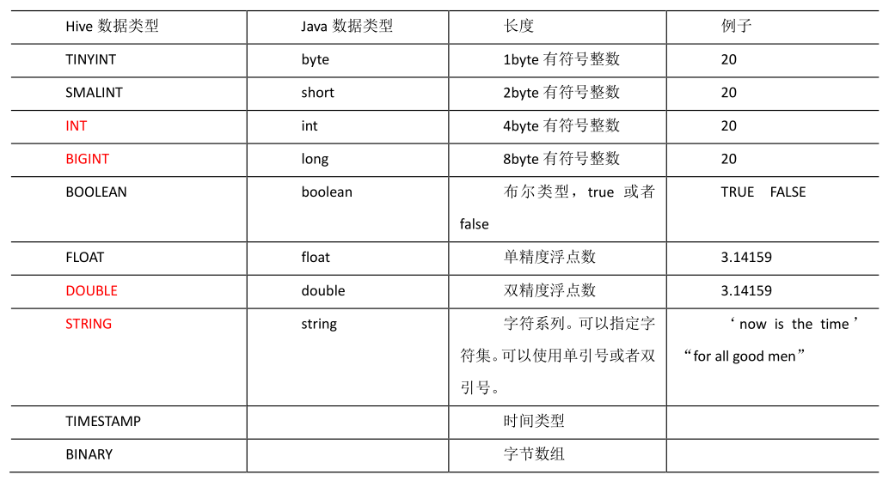

-  Hive 的 String 类型相当于数据库的 varchar 类型，该类型是一个**可变的字符串**，不过它不能声明其中最多能存储多少个字符，理论上它可以存储 2GB 的字符数。


### 集合数据类型

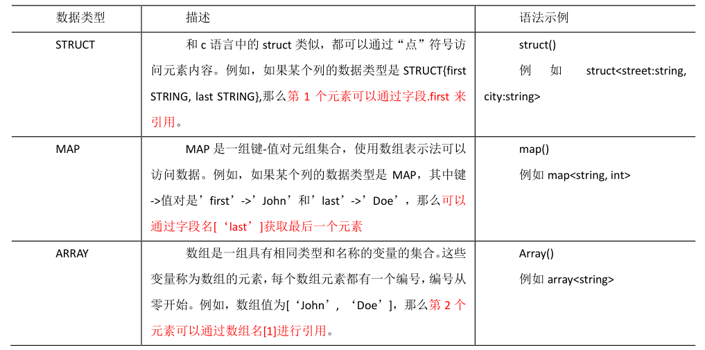

- 三种复杂数据类型允许任意层次的嵌套
- 因为定义时是从文件读取，所以在定义集合数据类型时，要定义分隔符
- Array：不同元素之间的分隔符
- Map：定义Key，value之间的分隔符，定义不同kv对之间的分隔符
- Struct：定义结构

```sql
#json格式
{
    "name": "songsong",
    "friends": ["bingbing" , "lili"] , //列表 Array,
    "children": { //键值 Map,
    "xiao song": 18 ,
    "xiaoxiao song": 19
	}
	"address": { //结构 Struct,
        "street": "hui long guan",
        "city": "beijing"
	}
}

#测试文件
songsong,bingbing_lili,xiao song:18_xiaoxiao song:19,hui long guan_beijing
yangyang,caicai_susu,xiao yang:18_xiaoxiao yang:19,chao yang_beijing

#建表语句
create table test(
name string,
friends array<string>,
children map<string, int>,
address struct<street:string, city:string>
)
row format delimited fields terminated by ','
collection items terminated by '_'
map keys terminated by ':'
```

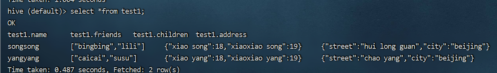


### 类型转化

#### 隐式转换

- 任何整数类型都可以隐式地转换为一个范围更广的类型，如 TINYINT 可以转换成INT，INT 可以转换成 BIGINT。
- 所有**整数类型、FLOAT 和 STRING 类型都可以隐式地转换成 DOUBLE。**
- TINYINT、SMALLINT、INT 都可以转换为 FLOAT。
- BOOLEAN 类型不可以转换为任何其它的类型。

#### 显示转换

- CAST('1' AS INT)将把字符串'1' 转换成整数 1；
- 如果强制类型转换失败，如执行CAST('X' AS INT)，表达式返回空值 NULL。


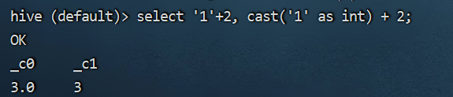

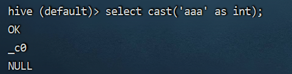


## DDL数据定义

### 创建数据库

```sql
CREATE DATABASE [IF NOT EXISTS] database_name 
[COMMENT database_comment]
[LOCATION hdfs_path]
[WITH DBPROPERTIES (property_name=property_value, ...)];

create database if not exists db_hive2 location '/db_hive2';
```


### 查询数据库

```sql
#显示数据库
show databases;

#显示数据库 + 过滤条件
show databases like 'db_hive*';

#显示数据库信息
desc database db_hive;

#显示数据库详细信息
desc database extended db_hive;

#切换数据库
use db_hive;
```


### 修改数据库

可以使用alter database 命令为某个数据库的DBPROPERTIES设置键值对属性

```sql
alter database db_hive
set dbproperties('createtime'='20220710');

#查看更新信息
desc database extended db_hive;
```


### 删除数据库

```sql
drop database if exists db_hive2;

#如果数据库不为空(one or more tables exist)，可以采用cascade命令，强制删除
drop database db_hive cascade;
```


### 创建表

#### 建表语句

```sql
CREATE [EXTERNAL] TABLE [IF NOT EXISTS] table_name
[(col_name data_type [COMMENT col_comment], ...)]
[COMMENT table_comment]
[PARTITIONED BY (col_name data_type [COMMENT col_comment], ...)]
[CLUSTERED BY (col_name, col_name, ...)
[SORTED BY (col_name [ASC|DESC], ...)] INTO num_buckets BUCKETS]
[ROW FORMAT row_format]
[STORED AS file_format]
[LOCATION hdfs_path]
[TBLPROPERTIES (property_name=property_value, ...)]
[AS select_statement
```

- EXTERNAL 关键字可以让用户创建一个外部表，**在建表的同时可以指定一个指向实际数据的路径（LOCATION）**，在删除表的时候，内部表的元数据和数据会被一起删除，而外部表只删除元数据，不删除数据。
- COMMENT：为表和列添加注释。
- PARTITIONED BY 创建分区表
- CLUSTERED BY 创建分桶表
- SORTED BY 不常用，对桶中的一个或多个列另外排序
- STORED AS 指定存储文件类型
  - 常用的存储文件类型：
  - SEQUENCEFILE（二进制序列文件）
  - TEXTFILE（文本）
  - RCFILE（列式存储格式文件）
  - 如果文件数据是纯文本，可以使用STORED AS TEXTFILE。
  - 如果数据需要压缩，使用 STOREDAS SEQUENCEFILE。
- LOCATION ：指定表在 HDFS 上的存储位置。
- AS：后跟查询语句，根据查询结果创建表。
- LIKE 允许用户复制现有的表结构，但是不复制数据。


#### 管理表(内部表)

- 默认创建的表都是所谓的管理表。
- 因为这种表，Hive 会（或多或少地）控制着数据的生命周期。
- Hive 默认情况下会将这些表的数据存储在由配置项hive.metastore.warehouse.dir(例如，/user/hive/warehouse)所定义的目录的子目录下。
- **当我们删除一个管理表时，Hive 也会删除这个表中数据。管理表不适合和其他工具共享数据。**


#### 外部表

- 因为表是外部表，所以 Hive **并非认为其完全拥有这份数据**。删除该表**并不会删除掉这份数据**，不过描述表的**元数据信息会被删除掉**。


#### 管理表和外部表的使用场景

- 每天将收集到的网站日志定期流入 HDFS 文本文件。
- **在外部表（原始日志表）的基础上做大量的统计分析**，用到的**中间表、结果表使用内部表存储**，**数据通过 SELECT+INSERT 进入内部表。**
- 如果数据不止Hive用，其它业务线也要用，那么建外部表。
- 外部表应用场景多，数据操作更安全。把原表drop，重新建表恢复元数据，还是会有查询结果。


#### 管理表与外部表的互相转换

```sql
#查询表的类型
desc formatted student2;

#修改内部表为外部表
alter table student2 set tblproperties('EXTERNAL'='TRUE');

#修改外部表为内部表
alter table student2 set tblproperties('EXTERNAL'='FALSE');
```

- ('EXTERNAL'='TRUE')和('EXTERNAL'='FALSE')为**固定写法，区分大小写**！


#### 建表时指定字段分隔符

- 如果不指定分隔符，存储到HDFS时，Hive会指定默认分隔符，不利于数据被其他框架操作。

```sql
create table test6(id int,name string)
row format delimited fields terminated by ',';
```


### 修改表

#### 重命名表

```sql
alter table table_name rename to new_table_name;
```

- 把表改名为一个已经存在的表名，会不允许修改。


#### 增加、修改和删除表分区

- 见后面分区表分桶表章节。


#### 增加/修改/替换列信息

- 如果当前类型string，想改为int，会不让改，因为改了后全是null
- change 对某一列生效
- replace 对当前表所有列生效
- **这些操作只是操作的元数据，不会更改HDFS中的数据，当列变少了，显示前面的；当列变多了，补null**

```sql
#更新列 - change
alter table table_name CHANGE [COLUMN] col_old_name col_new_name column_type [COMMENT col_comment] [FIRST|AFTER column_name]
alter table test1 change id test_id string;

#增加列 - add 代表新增一字段，字段位置为所有列后面(partition列前面)
ALTER TABLE table_name ADD COLUMNS (col_name data_type [COMMENT col_comment], ...)
alter table test1 add columns (name string);

#替换列 - replace 替换表中所有字段
ALTER TABLE table_name REPLACE COLUMNS (col_name data_type [COMMENT col_comment], ...)
alter table replace test1 columns (stu_id string);
#表中只剩下stu_id字段了
```


### 删除表

```sql
drop table dept;
```


## DML数据操作

### 数据导入

#### Load 向表中装在数据

```sql
load data [local] inpath '数据的 path' [overwrite] into table student [partition (partcol1=val1,…)];
```

- load data:表示加载数据
- local:表示从本地加载数据到 hive 表；否则从 HDFS 加载数据到 hive 表
- inpath:表示加载数据的路径
- overwrite:表示覆盖表中已有数据，否则表示追加
- into table:表示加载到哪张表
- student:表示具体的表
- partition:表示上传到指定分区

```sql
#加载本地文件
load data local inpath '/opt/module/hive-3.1.2/datas/students.txt' into table default.student;

#加载HDFS数据，相当于移动到hive的目录下面
dfs -put /opt/module/hive-3.1.2/datas/student.txt;

load data inpath '/student.txt' into table student1;

load data inpath '/user/ogleede/hive/student.txt' overwrite into table default.student;
```

**直接put进HDFS时查询不走MR**：元数据的numFiles和numRows不被修改

**load会修改numFiles，不会修改numRows**


#### Insert 通过查询语句向表中插入数据

```sql
#基于insert 用处少
insert into table student values(1,'wangwu'),(2,'zhaoliu');

#查询插入-单表
insert overwrite table student1 select id, name from student where month='201808';

#多表(多分区)插入模式-多表查询结果
from student
insert overwrite table student partition(month='201707')
select id, name where month='201709'
insert overwrite table student partition(month='201706')
select id, name where month='201709';

from student
insert into table student1
select id,name
insert into table student2
select id, name;
```

- insert into：以追加数据的方式插入到表或分区，原有数据不会删除
- insert overwrite：会覆盖表中已存在的数据

#### 

#### 查询语句中创建表并加载数据(as select)

```sql
create table if not exists student3 as select id, name from student;
```


#### 创建表时通过Location指定加载数据路径

```sql
dfs -mkdir /student;
dfs -put /opt/module/hive-3.1.2/datas/student.txt /student;

create external table if not exists student5(
id int, name string
)
row format delimited fields terminated by '\t'
location '/student';
```


#### import数据到指定Hive表中

**先用export导出后，再将数据导入，from的路径必须使用export导出的路径**

```sql
import table student2
from '/user/hive/warehouse/export/student'
```


### 数据导出

#### Insert导出

```sql
#将查询结果导出到本地
insert overwrite local directory '/opt/module/hive-3.1.2/datas/export/student' select * from student;

#将查询结果格式化导出到本地
insert overwrite local directory '/opt/module/hive-3.1.2/data/export/student1' row format delimited fields terminated by '\t' select * from student;

#将查询结果导出到HDFS  (无local)
insert overwrite directory '/user/ogleede/student2' row format delimited fields terminated by '\t' select * from student;
```


#### Hadoop命令导出到本地

**用这个吧，可以不进入hive客户端，直接hadoop命令即可**

```sql
#在hive客户端中
dfs -get /user/hive/warehouse/student/student.txt /opt/module/hive-3.1.2/data/export/student3.txt;
```


#### Hive shell命令导出(hive -f/-e 执行语句或者脚本 > file)

**最后文件中会带有表信息，使用之前要过滤，不推荐**

```shell
bin/hive -e 'select * from default.student;' > /opt/module/hive-3.1.2/datas/export/student4.txt;
```


#### Export导出到HDFS

**export和import主要用于两个Hadoop集群之间Hive表的迁移**

**import时，输入路径必须是export导出的路径；要写入的表要么不存在，要么存在没数据，不能既存在还有数据**

```sql
#在hive客户端中
export table default.student to '/user/hive/warehouse/export/student';
```


#### Sqoop导出

**要用于在Hadoop(Hive)与传统的数据库(mysql、postgresql...)间进行数据的传递，可以将一个关系型数据库中的数据导进到Hadoop的HDFS中，也可以将HDFS的数据导进到关系型数据库中。**

**方便将Hive计算结果导出、或者做数据准备的导入**


#### 清除表中数据(Truncate)

**Truncate只能删除管理表，不能删除外部表中数据**

```sql
truncate table student;
```


## 查询

```sql
SELECT [ALL | DISTINCT] select_expr, select_expr, ...
	FROM table_reference
	[WHERE where_condition]
	[GROUP BY col_list]
	[ORDER BY col_list]
	[CLUSTER BY col_list
		| [DISTRIBUTE BY col_list] [SORT BY col_list]
	]
	[LIMIT number]
```


### 基本查询

- SQL语言大小写不敏感
- SQL可以写在一行或者多行
- 关键字不能被缩写也不能分行
- 各子句一般要分行写
- 使用缩进提高语句可读性


#### 算术运算符

```sql
A + B
A - B
A * B
A / B
A % B
A & B  按位与
A | B  按位或
A ^ B  按位异或
~A     按位取反
```


#### Limit

**用于限制返回的行数**


#### Where

**紧随FROM**


#### 比较运算符

| 操作符                  | 支持的数据类型 |                             描述                             |
| ----------------------- | -------------- | :----------------------------------------------------------: |
| A=B                     | 基本数据类型   |              如果A等于B返回True，反之返回False               |
| A<=>B                   | 基本数据类型   | 如果 A 和 B 都为 NULL，则返回 TRUE，如果一边为 NULL返回 False |
| A<>B, A!=B              | 基本数据类型   | A 或者 B 为 NULL 则返回 NULL；如果 A 不等于 B，则返回TRUE，反之返回 FALSE |
| A<B                     | 基本数据类型   | A 或者 B 为 NULL，则返回 NULL；如果 A 小于 B，则返回TRUE，反之返回 FALSE |
| A [NOT] BETWEEN B AND C | 基本数据类型   | 如果 A，B 或者 C 任一为 NULL，则结果为 NULL。如果 A 的值大于等于 B 而且小于或等于 C，则结果为 TRUE，反之为 FALSE。如果使用 NOT 关键字则可达到相反的效果。 |
| A IS [NOT] NULL         | 所有数据类型   |        如果 A 等于 NULL，则返回 TRUE，反之返回 FALSE         |
| IN(数值 1, 数值 2)      | 所有数据类型   |                  使用 IN 运算显示列表中的值                  |
| A [NOT] LIKE B          | STRING 类型    | B 是一个 SQL 下的简单正则表达式，也叫通配符模式，如果 A 与其匹配的话，则返回 TRUE；反之返回 FALSE。B 的表达式说明如下：‘x%’表示 A 必须以字母‘x’开头，‘%x’表示 A必须以字母’x’结尾，而‘%x%’表示 A 包含有字母’x’,可以位于开头，结尾或者字符串中间。如果使用 NOT 关键字则可达到相反的效果。 |
| A RLIKE B, A REGEXP B   | STRING 类型    | B 是基于 java 的正则表达式，如果 A 与其匹配，则返回TRUE；反之返回 FALSE。匹配使用的是 JDK 中的正则表达式接口实现的，因为正则也依据其中的规则。例如，正则表达式必须和整个字符串 A 相匹配，而不是只需与其字符串匹配。 |


#### Like  RLike

- 使用Like运算选择类似的值
- 选择条件包含字符或数字
  - %代表0个或多个字符(任意个字符)
  - _代表一个字符
- RLIKE是Hive中的扩展，其可以通过 Java 的正则表达式这个更强大的语言来指定匹配条件。

```sql
#以A开头
select * from emp where ename LIKE 'A%';

#第二个字母为A的
select * from emp where ename LIKE '_A%';

#查找名字中带有 A的
select * from emp where ename RLIKE '[A]';
```


#### 逻辑运算符

- AND
- OR
- NOT


### 分组

GROUP BY 语句通常会和**聚合函数**一起使用，按照一个或者多个列队结果进行分组，然后**对每个组执行聚合操作。**


#### having

- where 后面**不能写分组函数**，而 having 后面**可以使用分组函数**。
- having **只用于 group by 分组统计语句**。


### join

表名前缀  ->  **使用表名前缀可以提高执行效率**。

**Hive支持全外连接**

#### 内连接

**只有进行连接的两个表中都存在与连接条件相匹配的数据才会被保留下来。**

```sql
select
e.empno, e.ename, d.deptno 
from emp e 
join dept d
on e.deptno = d.deptno;
```


#### 左外连接

**JOIN 操作符左边表中符合 WHERE 子句的所有记录将会被返回。**

```sql
select 
e.empno, e.ename, d.deptno 
from emp e 
left join dept d 
on e.deptno = d.deptno;
```


#### 右外连接

**JOIN 操作符右边表中符合 WHERE 子句的所有记录将会被返回。**

```sql
select 
e.empno, e.ename, d.deptno 
from emp e 
right join dept d 
on e.deptno = d.deptno;
```


#### 全外连接

**将会返回所有表中符合 WHERE 语句条件的所有记录。如果任一表的指定字段没有符合条件的值的话，那么就使用 NULL 值替代。**

```sql
select 
e.empno, e.ename, d.deptno 
from emp e 
full join dept d 
on e.deptno = d.deptno;
```


#### 取左表独有数据

**左外连接时，右表数据为null**

- join方式：左外连接后，where 右表字段为null的保留，即为左表独有数据
- not in ：利用子查询，左表的键，不在子查询的右表中


#### 取右表独有数据

同上


#### 取左右两表独有数据

**即不要两表共有部分**

- 在全外连接情况下，where A is null OR B is null
- 左表独有拼接右表独有：union，必须两表字段相同才能union

**union会对结果去重，union all不去重 所以更快一些**


#### 多表连接

**连接 n 个表，至少需要 n-1 个连接条件。**

```sql
SELECT 
e.ename, d.dname, l.loc_name
FROM emp e
JOIN dept d
ON d.deptno = e.deptno
JOIN location l
ON d.loc = l.loc;
```

- **大多数情况下，Hive 会对每对 JOIN 连接对象启动一个 MapReduce 任务。**
- 本例中会首先启动一个 MapReduce job 对表 e 和表 d 进行连接操作，然后会再启动一个 MapReduce job 将第一个 MapReduce job 的输出和表 l 进行连接操作。
- 注意：为什么不是表 d 和表 l 先进行连接操作呢？这是因为 **Hive 总是按照从左到右的顺序执行的**。
- 优化：**当对 3 个或者更多表进行 join 连接时，如果每个 on 子句都使用相同的连接键的话，那么只会产生一个 MapReduce job。**
- 目前Hive3版本，会自动优化为map join 将小表加载到内存。无论表顺序如何。


#### 笛卡尔积

- 笛卡尔积在以下条件产生
  - 省略连接条件
  - 连接条件无效
  - 所有中的所有行互相连接


### 排序

**order by 放在select语句结尾，进行全局reduce排序**

- 可按别名排序
- 可按多个列排序


#### 每个Reduce内部排序(Sort by)

- Sort By：对于**大规模的数据集 order by 的效率非常低**。在很多情况下，**并不需要全局排序，此时可以使用 sort by**
- Sort by 为每个 reducer 产生一个排序文件。每个 Reducer 内部进行排序，对全局结果集来说不是排序。

- **要和分区规则一起使用，为了减少数据倾斜，不指定会随机分配**


#### 分区(Distribute By)

- 在有些情况下，我们需要**控制某个特定行应该到哪个 reducer**，通常是为了进行后续的聚集操作。
- distribute by 子句可以做这件事。**distribute by 类似 MR 中 partition（自定义分区），进行分区，结合 sort by 使用。**

```sql
#先按部门编号分区，再按员工编号降序排序
set mapreduce.job.reduces=3;

insert overwrite local directory '/opt/module/data/distribute-result' select * from emp distribute by deptno sort by empno desc;
```


- distribute by 的**分区规则**是根据**分区字段的 hash 码与 reduce 的个数进行模除**后，余数相同的分到一个区。
- Hive 要求 **DISTRIBUTE BY 语句要写在 SORT BY 语句之前**。


#### Cluster By

- **当 distribute by 和 sorts by 字段相同时，可以使用 cluster by 方式。**

- **cluster by 除了具有 distribute by 的功能外还兼具 sort by 的功能**。但是排序**只能是升序排序**，不能指定排序规则为 ASC 或者 DESC。

```sql
#以下两种写法等价
select * from emp cluster by deptno;
select * from emp distribute by deptno sort by deptno;
```


#### 排序总结

- Order by 全局排序，效率很低，数据量大时无法运行的，一个reduce任务扛不住
- Sort by 区内排序，单独使用时，随机划分分区
- distribute by 指定分区字段
- 当distribute by 和sort by 字段相同时，而且升序时，可用cluster by 代替之


## 分区表分桶表

### 分区表

- 数据量太大，分区提高并行度，就相当于map端切片，reduce端分区
- 分区表实际上就是对应一个 **HDFS 文件系统上的独立的文件夹**，该文件夹下是该分区所有的数据文件。
- Hive 中的**分区就是分目录**，**把一个大的数据集根据业务需要分割成小的数据集。**
- 在查询时**通过 WHERE 子句中的表达式选择查询所需要的指定的分区**，**避免全表扫描**，这样的**查询效率会提高很多**。

#### 基本操作

##### 创建分区表

```sql
#创建分区表
create table dept_partition(
deptno int, dname string, loc string
)
partitioned by (day string)
row format delimited fields terminated by '\t';
```

**分区字段不能是表中已经存在的数据，可以将分区字段看作表的伪列。**


##### 加载数据

```sql
#加载数据到分区表
load data local inpath '/opt/module/hive-3.1.2/datas/dept_20220716.log' into table dept_partition partition(day='20220716');
```

**分区表加载数据时，必须指定分区**


##### 查询

```sql
#查询
select * from dept_partition where day='20220716';

#多分区联合查询
select * from dept_partition where day='20220716'
union 
select * from dept_partition where day='20220715'
union 
select * from dept_partition where day='20220714'

select * from dept_partition where day='20220716' or day='20220715' or  day='20220714'; 
```


##### 增加分区

```sql
#创建单个分区
alter table dept_partition add partition(day='20220711');

#同时创建多个分区
alter table dept_partition add partition(day='20220710') partition(day='20220709');
```


##### 删除分区

```sql
#删除单个分区
alter table dept_partition drop partition(day='20220709');

#同时删除多个分区,注意有个逗号
alter table dept_partition drop partition(day='20220710'), partition(day='20220711');
```


##### 查看分区表有多少分区

```sql
show partitions dept_partition;
```


##### 查看分区表结构

```sql
desc formatted dept_partition;
```


#### 二级分区

**如果一天的日志数据量也很大，如何再将数据拆分？**


##### 创建二级分区表

```sql
create table dept_partition2(
deptno int, dname string, loc string
)
partitioned by (day string, hour string)
row format delimited fields terminated by '\t';
```


##### 加载数据 查询

```sql
load data local inpath '/opt/module/hive-3.1.2/datas/dept_20220716.log' into table dept_partition2 partition(day='20220716', hour='12');

select * from dept_partition2 where day='20220716' and hour = '12';
```


##### 把数据直接上传到分区目录上，让分区表和数据产生关联的三种方式

- 上传数据后修复

  - ```sql
    #上传后直接查询，查询不到
    dfs -mkdir -p
    /user/hive/warehouse/mydb.db/dept_partition2/day=20200401/hour=13;
    hive (default)> dfs -put /opt/module/datas/dept_20200401.log
    /user/hive/warehouse/mydb.db/dept_partition2/day=20200401/hour=13;
    
    #修复命令
    msck repair table dept_partition2;
    ```

- 上传数据后添加分区

  - ```sql
    alter table dept_partition2 add partition(day='20220716', hour='14');
    ```

- 创建文件夹后load数据到分区

  - ```sql
    dfs -mkdir -p /user/hive/warehouse/mydb.db/dept_partition2/day=20220716/hour=14;
    
    load data local inpath '/opt/module/hive-3.1.2/datas/dept_20220716.log' into table dept_partition2 partition(day='20220716',hour='14');
    ```

  - 


#### 动态分区调整

- 关系型数据库中，**对分区表 Insert 数据时候，数据库自动会根据分区字段的值，将数据插入到相应的分区中.**
- 根据查询的字段来动态决定数据的分区
- Hive 中也提供了类似的机制，即动态分区(Dynamic Partition)，只不过，使用 Hive 的动态分区，**需要进行相应的配置。**


##### 开启动态分区参数设置

```sql
#开启动态分区功能(默认true 开启)
hive.exec.dynamic.partition=true

#设置为非严格模式(动态分区的模式，默认为strict，表示必须指定至少一个分区为静态分区，nonstrict模式表示允许所有的分区字段都可以使用动态分区)
hive.exec.dynamic.partition.mode=nonstrict

#在所有执行MR的节点上，最大以供可以创建多少个动态分区。默认1000
hive.exec.max.dynamic.partitions=1000

#在每个执行MR的节点上，最大可以创建多少个动态分区。该参数需要根据实际的数据来设定。
#比如源数据中包含了一年的数据，即day字段有365个值，那么该参数就需要设置成大于365，如果使用默认值100，则会报错。
hive.exec.max.dynamic.partitions.pernode=100

#整个MR Job中，最大可以创建多少个HDFS文件。默认100000
hive.exec.max.created.files=100000

#当有空分区生成时，是否抛出异常。一般不需要设置。默认false
hive.error.on.empty.partition=false
```


```sql
#创建目标分区表
create table dept_partition_dy(id int, name string) partitioned by (loc int) row format delimited fields terminated by '\t';

#设置动态分区
set hive.exec.dynamic.partition.mode=nonstrict;
insert into table dept_partition_dy partition(loc) select deptno,dname,loc from dept;

#查看目标分区表的分区情况
show partitions dept_partition;

#Hive3中，可以省略静态分区的分区字段，会自动动态分区
insert into table dept_partition_dy partition(deptno='70') select deptno,dname,loc from dept;
insert into table dept_partition_dy select deptno,dname,loc from dept;
#甚至在严格模式下也可以省略静态分区字段
```

**查询时将分区字段放在最后一位**


### 分桶表

- 分区提供一个**隔离数据和优化查询**的便利方式。
- 不过，**并非所有的数据集都可形成合理的分区**。
- **对于一张表或者分区，Hive 可以进一步组织成桶，也就是更为细粒度的数据范围划分。**
- 分桶是将数据集**分解成更容易管理的若干部分**的另一个技术。
- **分区针对的是数据的存储路径**；**分桶针对的是数据文件，把一个文件拆分成多个文件**。


#### 用途

- 在数据集极大时使用
- 匹配抽样查询


#### 创建分桶表

```sql
#创建分桶表
create table stu_buck(id int, name string)
clustered by(id)
into 4 buckets
row format delimited fields terminated by '\t';

#查看表结构
desc formatted stu_buck;

#导入数据到分桶表中，load方式
load data inpath '/student.txt' into table stu_buck;

#进入HDFS查看创建的分桶表是否分为4个桶
/user/hive/warehouse/mydb.db/stu_buck
```


#### 分桶规则

- Hive 的分桶采用**对分桶字段的值进行哈希**，然后**除以桶的个数求余**的方式决定该条记录存放在哪个桶当中
- 分区表的字段必须不是表字段，而分桶表字段必须是表的其中某1个字段


#### 分桶注意事项

- reduce 的个数设置为**-1**,让 Job **自行决定需要用多少个 reduce** 或者将 **reduce 的个数设置为大于等于分桶表的桶数**
- 从HDFS中load数据到分桶表中，避免本地文件找不到问题
- 不要使用本地模式


#### insert方式将数据导入分桶表

```sql
insert into table stu_buck select * from student_insert;
```


### 抽样查询

- **对于非常大的数据集，有时用户需要使用的是一个具有代表性的查询结果而不是全部结果。**
- Hive 可以通过对表进行抽样来满足这个需求。


#### 语法

```sql
#语法
TABLESAMPLE(BUCKET x OUT OF y)

select * from stu_buck tablesample(bucket 1 out of 4 on id);
```

- **x的值必须≤y的值，否则报错**

```sql
FAILED: SemanticException [Error 10061]: Numerator should not be bigger than denominator in sample clause for table stu_buck
```


- y必须是table总bucket数的倍数或者因子。hive根据y的大小，决定抽样的比例。
- 例如，table总共分了4份，当y=2时，抽取(4/2=)2个bucket的数据，当y=8时，抽取(4/8=)1/2个bucket的数据。

- x表示从哪个bucket开始抽取，如果需要取多个分区，以后的分区号为当前分区号加上y。
- 例如，table总bucket数为4，tablesample(bucket 1 out of 2)，表示总共抽取（4/2=）2个bucket的数据，抽取第1(x)个和第3(x+y)个bucket的数据。
- y也可以理解为将数据集分为几等份，x表示从第几份开始抽取


## 函数

### 系统内置函数

```sql
#查看系统自带函数
show functions;

#显示自带的函数的用法
desc function upper;

#详细显示自带的函数的用法
desc function extended upper;
```


### 常用内置函数

#### 空字段赋值- NVL

- NVL：给值为 NULL 的数据赋值，它的格式是 NVL( value，default_value)。
- 它的功能是如果 value 为 NULL，则 NVL 函数返回 default_value 的值，否则返回 value 的值，如果两个参数都为 NULL ，则返回 NULL。

```sql
select comm, nvl(comm, -1) from emp;
select comm, nvl(comm, mgr) from emp;
```


#### CASE WHEN THEN ELSE END

```sql
#查询不同部门男女各多少人
select
	dept_id,
	sum(case sex when '男' then 1 else 0 end) male_ct,
	sum(case sex when '女' then 1 else 0 end) female_ct
from emp_sex
group by dept_id;
```


#### 行转列(多列拼成一列)

- CONCAT(string A/col, string B/col…)：返回输入字符串连接后的结果，支持任意个输入字符串;
- CONCAT_WS(separator, str1, str2,...)：它是一个特殊形式的 CONCAT()。
  - 第一个参数剩余参数间的分隔符。分隔符可以是与剩余参数一样的字符串。
  - 如果分隔符是 NULL，返回值也将为 NULL。
  - 这个函数会跳过分隔符参数后的任何 NULL 和空字符串。
  - 分隔符将被加到被连接的字符串之间;
  - 注意: CONCAT_WS must be "string or array<string>
- COLLECT_SET(col)：函数只接受基本数据类型，它的主要作用是将某字段的值进行去重汇总，产生 Array 类型字段。

```sql
concat : 拼串
concat_ws: 拼串，指定了分隔符，多元素拼串时简单些。可以放数组元素，将数组所有元素按分隔符拼接。
collect_list : 一个聚合函数，将某列传入，不去重，产生Array
collect_set : 一个聚合函数，将某列传入，去重后，产生Array
```


#### 列转行(一行转多行)

- EXPLODE(col)：将 hive 一列中复杂的 Array 或者 Map 结构拆分成多行。
- LATERAL VIEW  侧写表
  - 用法：LATERAL VIEW udtf(expression) tableAlias AS columnAlias
  - 解释：用于和 split, explode 等 UDTF 一起使用，它能够将一列数据拆成多行数据，在此基础上可以对拆分后的数据进行聚合。

```sql
#将friends数组中的内容转换成列输出
select explode(friends) from test3;
```


```sql
#lateral view 如果炸裂时还需要原表中的数据，那么加侧写表
# 《疑犯追踪》 悬疑,动作,科幻,剧情  ->
#《疑犯追踪》 悬疑
#《疑犯追踪》 动作
#《疑犯追踪》 科幻
#《疑犯追踪》 剧情

select 
	movie, 
	category_name
from
	movie_info
lateral view
	explode(split(category, ",")) movie_info_tmp as category_name;
```


#### 窗口函数

- OVER()：**指定**分析函数工作的**数据窗口大小**，这个数据窗口大小可能会随着行的变而变化.
  - 类似group by 不过其窗口大小是不固定的，而groupby是固定的
- CURRENT ROW：当前行
- n PRECEDING：往前 n 行数据
- n FOLLOWING：往后 n 行数据
- UNBOUNDED：起点，
  - UNBOUNDED PRECEDING 表示从前面的起点，
  - UNBOUNDED FOLLOWING 表示到后面的终点
- LAG(col,n,default_val)：往前第 n 行数据
- LEAD(col,n, default_val)：往后第 n 行数据
- NTILE(n)：把有序窗口的行分发到指定数据的组中，各个组有编号，编号从 1 开始，对于每一行，NTILE 返回此行所属的组的编号。注意：n 必须为 int 类型。


```sql
#数据准备 name, orderdate, cost
jack,2017-01-01,10
tony,2017-01-02,15
jack,2017-02-03,23
tony,2017-01-04,29
jack,2017-01-05,46
jack,2017-04-06,42
tony,2017-01-07,50
jack,2017-01-08,55
mart,2017-04-08,62
mart,2017-04-09,68
neil,2017-05-10,12
mart,2017-04-11,75
neil,2017-06-12,80
mart,2017-04-13,94

vim business.txt

create table business(
name string,
orderdate string,
cost int
) ROW FORMAT DELIMITED FIELDS TERMINATED BY ',';
load data local inpath "/opt/module/hive-3.1.2/business.txt" into table
business;
```


##### 需求

- 查询在 2017 年 4 月份购买过的顾客及总人数

  - ```sql
    select name, count(*)
    from business
  where substring(orderdate,1,7) = '2017-04'
    group by name;
    
    name    _c1
    jack    1
    mart    4
    
    select name, count(*) over ()
    from business
    where substring(orderdate,1,7) = '2017-04'
    group by name;
    
    name    count_window_0
    mart    2
    jack    2
    
    select name, count(*) over ()
    from business
    where substring(orderdate,1,7) = '2017-04';
    
    name    count_window_0
    mart    5
    mart    5
    mart    5
    mart    5
    jack    5
    ```
    
  - over()里面没放东西，统计所有行

  - group by 是根据字段分组，多对一的关系

  - 而over如果不指定条件，那么每条数据都留下，是一对一的关系

- 查询顾客的购买明细及月购买总额

  - ```sql
    #报错，没有group by 字段
    select name, orderdate, cost, sum(cost)
    from business;
    
    #得到的是全部人的cost总和，而不是按人来区分
    select name, orderdate, cost, sum(cost) over()
    from business;
    
    select name, orderdate, cost, sum(cost) over(partition by name, month(orderdate))
    from business;
    ```

  - partition by 用于限定当前开窗大小

- 上述的场景, 将每个顾客的 cost 按照日期进行累加(每个顾客按日期递增，对cost累加)

  - 每一条数据的开窗大小都不同，以jack为例，第一条数据开窗大小为1，第二条数据开窗大小为2

  - ```sql
    select name, orderdate, cost,sum(cost) over(partition by name order by orderdate)
    from business;
    
    select name, orderdate, cost,sum(cost) over(partition by name order by orderdate rows between UNBOUNDED PRECEDING and current row) 
    from business;
    
    #会出现null值，第1行不存在值
    select name, orderdate, cost,sum(cost) over(partition by name order by orderdate rows between UNBOUNDED PRECEDING and 1 PRECEDING) 
    from business;
    
    #只看信息做累加
    select name, orderdate, cost,sum(cost) over(order by orderdate) 
    from business;
    ```

  - 只有order by 不指定窗口信息，那么默认就是从起点到当前行

  - ```sql
    1
    2
    3
    3
    4
    5
    
    select id, sum(id) over(order by id) 
    from num;
    
    1	1
    2	3
    3	9
    3	9
    4	13
    5	18
    ```

  - 对于3  窗口都在第二个3

- 查询每个顾客上次的购买时间

  - ```sql
    select name,orderdate, lag(orderdate, 1) over(partition by name order by orderdate)
    from business;
    ```

  - lag() 第3个参数可以省略，为默认值，省略为null

- 查询前 20%时间的订单信息

  - ```sql
    #分5组取第一组
    select name, orderdate, cost from (
    	select name,orderdate,cost,ntile(5) over(order by orderdate) groupId
    	from business;
    ) t1 
    where groupId = 1;
    
    ```

    

#### Rank

- RANK() 排序相同时会重复，总数不会变   1 1 3
- DENSE_RANK() 排序相同时会重复，总数会减少  1 1 2
- ROW_NUMBER() 会根据顺序计算  1 2 3

```sql
select name, subject, score,
rank() over(partition by subject order by score desc) rp,
dense_rank() over(partition by subject order by score desc) drp,
row_number() over(partition by subject order by score desc) rmp
from score;
```


#### 其他常用函数

- 常用日期函数

  - ```sql
    unix_timestamp:返回当前或指定时间的时间戳	
    select unix_timestamp();
    select unix_timestamp("2020-10-28",'yyyy-MM-dd');
    
    from_unixtime：将时间戳转为日期格式
    select from_unixtime(1603843200);
    
    current_date：当前日期
    select current_date;
    
    current_timestamp：当前的日期加时间
    select current_timestamp;
    
    to_date：抽取日期部分
    select to_date('2020-10-28 12:12:12');
    
    year：获取年
    select year('2020-10-28 12:12:12');
    
    month：获取月
    select month('2020-10-28 12:12:12');
    
    day：获取日
    select day('2020-10-28 12:12:12');
    
    hour：获取时
    select hour('2020-10-28 12:12:12');
    
    minute：获取分
    select minute('2020-10-28 12:12:12');
    
    second：获取秒
    select second('2020-10-28 12:12:12');
    
    weekofyear：当前时间是一年中的第几周
    select weekofyear('2020-10-28 12:12:12');
    
    dayofmonth：当前时间是一个月中的第几天
    select dayofmonth('2020-10-28 12:12:12');
    
    months_between： 两个日期间的月份
    select months_between('2020-04-01','2020-10-28');
    
    add_months：日期加减月
    select add_months('2020-10-28',-3);
    
    datediff：两个日期相差的天数
    select datediff('2020-11-04','2020-10-28');
    
    date_add：日期加天数
    select date_add('2020-10-28',4);
    
    date_sub：日期减天数
    select date_sub('2020-10-28',-4);
    
    last_day：日期的当月的最后一天
    select last_day('2020-02-30');
    
    date_format(): 格式化日期
    select date_format('2020-10-28 12:12:12','yyyy/MM/dd HH:mm:ss');
    ```

- 常用取整函数

  - ```sql
    round： 四舍五入
    select round(3.14);
    select round(3.54);
    
    ceil：  向上取整
    select ceil(3.14);
    select ceil(3.54);
    
    floor： 向下取整
    select floor(3.14);
    select floor(3.54);
    ```

- 常用字符串操作函数

  - ```sql
    upper： 转大写
    select upper('low');
    
    lower： 转小写
    select lower('low');
    
    length： 长度
    select length("atguigu");
    
    trim：  前后去空格
    select trim(" atguigu ");
    
    lpad： 向左补齐，到指定长度
    select lpad('atguigu',9,'g');
    
    rpad：  向右补齐，到指定长度
    select rpad('atguigu',9,'g');
    
    regexp_replace：使用正则表达式匹配目标字符串，匹配成功后替换！
    SELECT regexp_replace('2020/10/25', '/', '-');
    ```

- 集合操作

  - ```sql
    size： 集合中元素的个数
    select size(friends) from test3;
    
    map_keys： 返回map中的key
    select map_keys(children) from test3;
    
    map_values: 返回map中的value
    select map_values(children) from test3;
    
    array_contains: 判断array中是否包含某个元素
    select array_contains(friends,'bingbing') from test3;
    
    sort_array： 将array中的元素排序
    select sort_array(friends) from test3;
    ```


### 自定义函数

- UDF（User-Defined-Function） - 一进一出
- UDAF（User-Defined Aggregation Function） 多进一出
- UDTF（User-Defined Table-Generating Functions）  一进多出 炸裂函数
  - 比如lateral view explode()


#### 编程步骤

- 继承Hive提供的类

  - org.apache.hadoop.hive.ql.udf.generic.GenericUDF
  - org.apache.hadoop.hive.ql.udf.generic.GenericUDTF

- 实现类中的抽象方法

- 在hive的命令行窗口创建函数

  - ```sql
    #添加jar,如果放在hive的lib目录下，重新进入hive客户端时，不再需要add jar命令
    add jar linux_jar_path;
    
    #创建function
    create [temporary] function [dbname.]function_name as class_name;
    
    create temporary function my_len as "com.ogleede.MyUDF";
    ```

- 在hive的命令行窗口删除函数

  - ```sql
    drop [temporary] function [if exists] [dbname.]function_name;
    ```

    

### 自定义UDF函数

> 见hive-demo


### 自定义UDTF函数

> 见hive-demo


### Word Count

```sql
select word, count(*) 
from (
    select explode(split(words, ',')) word from input
	 ) t1
group by word;
    
```


### With 用法

[hive之with...as的用法--大王学大数据](https://www.cnblogs.com/dw-date/p/14266248.html)

- with 。。as需要定义一个sql片段**,会将这个片段产生的结果集保存在内存中,**后续的sql均可以访问这个结果集,**作用与视图或临时表类似**.
- hive可以**通过with查询来提高查询性能**：
  - **先通过with语法将数据查询到内存，然后后面其他查询可以直接使用**
- `with...as...`必须和其他sql一起使用(可以定义一个`with`但在后续语句中不使用)
- `with...as...`是一次性的，是临时的


#### 单独使用

```sql
#with table_name as(子查询语句) 其他sql

with temp as (
	select * from xxx
)
select * from temp;
```


#### 嵌套使用

```sql
with temp2 as (
	with temp1 as (
    	select * from xxx;
    )
    select * from temp1;
)
select * from temp2;
```


#### 当Join...on...使用

```sql
with temp1 as (
	select * from xxx
), temp2 as (
	select * from xxx
)
select * from temp1, temp2;
```

**一般来说，表少用join...on ，表多用 with...as**

**`关于With的用法，需要在实践中扩充总结。`**


### 多维分析

[hive多维分析-私人小院](https://www.cnblogs.com/bajiaotai/p/15223798.html)


#### group sets

[官网文档](https://cwiki.apache.org/confluence/display/Hive/Enhanced+Aggregation%2C+Cube%2C+Grouping+and+Rollup)

- 相当于按多种方式group by 然后将结果union起来，字段少的补null

  - ```sql
    # 最后一个括号不写，表示总数
    select deptid,gender,count(*) from staff group by deptid, gender
    grouping sets((deptid,gender),deptid,gender,());
    ```

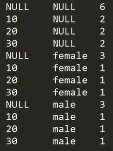

- 多维分析只走一个MR任务，如果多表group by 再union会走多个MR任务。

  - ```java
    //将上面的SQL转化为MR程序
    //Mapper: 1001,zhangsan,male,10
    //一条数据来了，要写出多条, 多条的key不同，把key封装成不同的对象
    //context.write((null, null), 1L);
    //context.write((10, null), 1L);
    //context.write((null, male), 1L);
    //context.write((10, male), 1L);
    //Reducer: 数据累加
    ```


#### grouping_id

- 判断维度是否参与计算，区分是维度内容为null，还是多维设置为null
- 返回值：返回一个与每列是否存在相对应的位向量(10进制)
  - 对应维度  参与为1  不参与为0
  - 见下面的查询结果，从左到右分别是二进制左移，根据grouping_id可以知道哪些列参与了group by


```sql
with t1 as (
	select  'vivo' as channel ,'001' as id,'1983' as iphone,8 as pv
)
select channel,id,iphone,grouping_id,sum(pv) 
from t1 
group by channel,id,iphone 
grouping sets ( channel,id,iphone,(channel,id,iphone),() )

channel    id    	iphone    grouping__id    _c4
NULL    	NULL    NULL    	0    8
NULL    	NULL    1983    	4    8
NULL    	001     NULL    	2    8
vivo    	NULL    NULL    	1    8
vivo    	001     1983    	7    8
1       	2       4       		 8
```


#### with rollup(上卷)

```sql
  GROUP BY a, b, c, WITH ROLLUP  
  #相当于 
  GROUP BY a, b, c GROUPING SETS ( (a, b, c), (a, b), (a), ( ))
```

```sql
with t1 as (
	select  '2021' as year ,'202109' as month,'20210909' as day,8 as pv
)
select year,month,day,grouping__id,sum(pv) as total from t1
group by year,month,day
with rollup
```


#### with cube(多维)

- 计算出所有的维度组合

 ```sql
GROUP BY a, b, c WITH CUBE 
#is equivalent to
GROUP BY a, b, c GROUPING SETS ( (a, b, c), (a, b), (b, c), (a, c), (a), (b), (c), ( ))
 ```

- 维度组合数：2的x次幂，x=维度个数


## 压缩和存储

> 即使换成Spark引擎，读写数据还是用的InputFormat，OutputFormat


### Hadoop压缩配置

#### MR支持的压缩编码

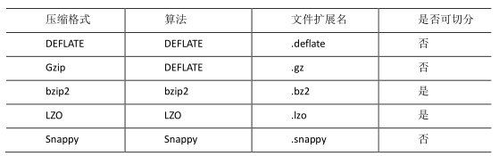

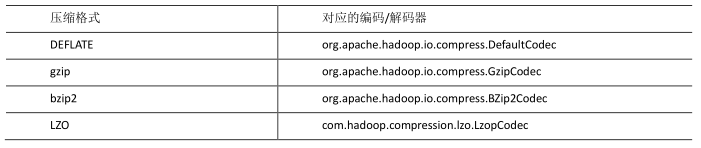


**常用的是LZO和Snappy，区别是文件是否可切片**


### 开启Map输出阶段压缩(MR引擎)

> 开启map输出阶段压缩，可以减少job中map和reduce间数据传输量。


```shell
#开启hive中间传输数据压缩功能
set hive.exec.compress.intermediate=true;

#开启mapreduce中map输出压缩功能
set mapreduce.map.output.compress=true;

#设置mapreduce中map输出数据的压缩方式
set mapreduce.map.output.compress.codec=org.apache.hadoop.io.compress.SnappyCodec;
```


### 开启Reduce输出阶段压缩

> 当 Hive 将 输 出 写 入 到 表 中 时 ， 输 出 内 容 同 样 可 以 进 行 压 缩 。 属 性 hive.exec.compress.output 控制着这个功能。用户可能需要保持默认设置文件中的默认值false，这样默认的输出就是非压缩的纯文本文件了。用户可以通过在查询语句或执行脚本中设置这个值为 true，来开启输出结果压缩功能。


```shell
#开启hive最终输出数据压缩功能
set hive.exec.compress.output=true;

#开启mapreduce最终输出数据压缩
set mapreduce.output.fileoutputformat.compress=true;

#设置mapreduce最终数据输出压缩方式
set mapreduce.output.fileoutputformat.compress.codec=org.apache.hadoop.io.compress.SnappyCodec;

#设置mapreduce最终数据输出压缩为块压缩
set mapreduce.output.fileoutputformat.compress.type=BLOCK;
```


### 文件存储格式

> Hive支持的存储数据的格式主要有：TEXTFILE, SEQUENCEFILE,ORC,PARQUET


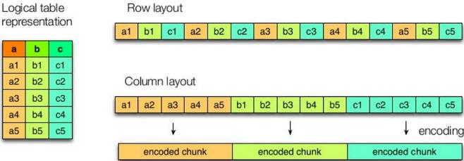

> 上图左边为逻辑表，右上为行式存储，右下为列式存储

- 行存储特点
  - **查询满足条件的一整行数据的时候**，列存储则需要去每个聚集的字段找到对应的每个列的值，行存储只需要找到其中一个值，其余的值都在相邻地方，所以**此时行存储查询的速度更快。**
- 列存储特点
  - 因为每个字段的数据**聚集存储**，在**查询只需要少数几个字段的时候**，能**大大减少读取的数据量**；每个字段的数据类型一定是相同的，列式存储可以**针对性的设计更好的设计压缩算法**
- TEXTFILE 和 SEQUENCEFILE 的存储格式都是基于行存储的；
- ORC 和 PARQUET 是基于列式存储的。


### 存储和压缩结合

> 在实际的项目开发当中，hive 表的数据存储格式一般选择：orc 或 parquet。压缩方式一般选择 snappy，lzo。


## 调优

### 执行计划(Explain)

> 基本语法：explain [extended | dependency | authorization] query
>
> 在优化器之后，执行之前。产生的计划是优化后的计划


```sql
#select * 不走MR任务，直接本地抓取

explain select * from xxx;

#走MR任务的
explain select deptno, avg(sal) avg_sal from emp group by deptno;
```

> extended参数是详细的执行计划


### Fetch抓取

- Fetch 抓取是指，Hive 中对某些情况的查询可以不必使用 MapReduce 计算。
- 例如：SELECT * FROM employees;
- 在这种情况下，Hive 可以简单地读取 employee 对应的存储目录下的文件，然后输出查询结果到控制台。
- 在 hive-default.xml.template 文件中 **hive.fetch.task.conversion** 默认是 more，老版本 hive默认是 minimal，**该属性修改为 more 以后，在全局查找、字段查找、limit 查找等都不走mapreduce。**


### 本地模式

- 大多数的 Hadoop Job 是需要 Hadoop 提供的完整的可扩展性来处理大数据集的。
- 不过，**有时 Hive 的输入数据量是非常小的。在这种情况下，为查询触发执行任务消耗的时间可能**
  **会比实际 job 的执行时间要多的多**。
- 对于大多数这种情况，Hive 可以通过本地模式在单台机器上处理所有的任务。**对于小数据集，执行时间可以明显被缩短。**
- 用户可以通过设置 hive.exec.mode.local.auto 的值为 true，来让 Hive 在适当的时候**自动**启动这个优化。

```shell
set hive.exec.mode.local.auto=true; //开启本地 mr
//设置 local mr 的最大输入数据量，当输入数据量小于这个值时采用 local mr 的方式，默认
为 134217728，即 128M
set hive.exec.mode.local.auto.inputbytes.max=50000000;
//设置 local mr 的最大输入文件个数，当输入文件个数小于这个值时采用 local mr 的方式，默
认为 4
set hive.exec.mode.local.auto.input.files.max=10;
```


### 表的优化

#### 小表大表join(Map Join)

- 将 key 相对分散，并且数据量**小的表放在 join 的左边**，**可以使用 map join 让小的维度表先进内存**。在 map 端完成 join。
- 实际测试发现：新版的 hive 已经对小表 JOIN 大表和大表 JOIN 小表进行了优化。**小表放**
  **在左边和右边已经没有区别**。

```shell
#设置自动选择Map join
set hive.auto.convert.join = true;//默认true

#大表小表的阈值设置（默认 25M 以下认为是小表）
set hive.mapjoin.smalltable.filesize = 25000000;
```


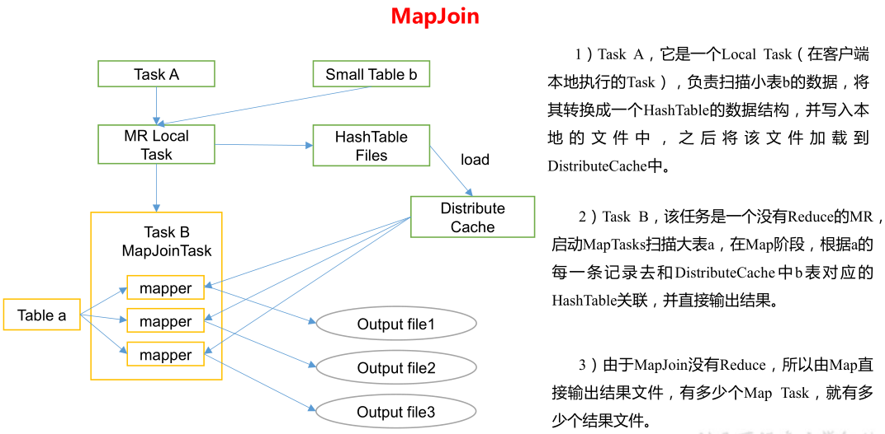


#### 大表join大表

##### 空Key过滤

> 非inner join 使用

- **有时 join 超时是因为某些 key 对应的数据太多，而相同 key 对应的数据都会发送到相同的 reducer 上，从而导致内存不够**。此时我们应该仔细分析这些异常的 key，很多情况下，这些 key 对应的数据是异常数据，我们需要在 SQL 语句中进行过滤。

```sql
insert overwrite table jointable 
select n.* 
from (
    select * from nullidtable where id is not null) n 
left join bigtable o on n.id = o.id;
```


##### 空Key转换

- 有时**虽然某个 key 为空**对应的数据很多，但是**相应的数据不是异常数据**，必须要包含在join 的结果中，此时我们**可以表 a 中 key 为空的字段赋一个随机的值，使得数据随机均匀地分不到不同的 reducer 上**。
- 这也是处理相同key数据过多，发生数据倾斜的一种方式。

```sql
insert overwrite table jointable
select n.* from nullidtable n full join bigtable o on
nvl(n.id,rand()) = o.id;
```

**注意nvl给的随机数和右边的id不能有重叠**


##### SMB(Sort Merge Bucket Join) 分桶表

> 数据量太大，先把两张大表分别分桶，按桶来join。就是把两张大表按join字段分别分成小表，再将join结果组合起来。体现了mapreduce的分治思想。

```sql
#创建分桶表，桶的个数不要超过可用CPU的核数
create table bigtable_buck1(
    id bigint,
    t bigint,
    uid string,
    keyword string,
    url_rank int,
    click_num int,
    click_url string)
clustered by(id)
sorted by(id)
into 6 buckets
row format delimited fields terminated by '\t';
load data local inpath '/opt/module/data/bigtable' into table
bigtable_buck1;
```


> 设置参数

```shell
set hive.optimize.bucketmapjoin = true;
set hive.optimize.bucketmapjoin.sortedmerge = true;
set hive.input.format=org.apache.hadoop.hive.ql.io.BucketizedHiveInputFormat;
```


#### Group By (处理数据倾斜)

> 默认情况下，Map 阶段同一 Key 数据分发给一个 reduce，当一个 key 数据过大时就倾斜了。

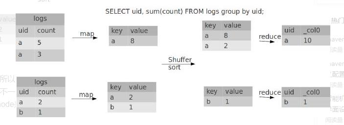

并不是所有的聚合操作都需要在 Reduce 端完成，**很多聚合操作都可以先在 Map 端进行部分聚合**，最后在 Reduce 端得出最终结果。


```shell
#是否在map端进行聚合，默认true
set hive.map.aggr = true;

#在map端进行聚合操作的条目数量
set hive.groupby.mapaggr.checkinterval = 100000

#在数据倾斜的时候进行负载均衡(默认false)
set hive.groupby.skewindata = true;
```

- 当选项设定为 true，生成的查询计划会有两个 MR Job。
- 第一个 MR Job 中，**Map 的输出结果会随机分布到 Reduce 中**，每个 Reduce 做**部分聚合**操作，并输出结果，这样处理的结果是**相同的 Group By Key 有可能被分发到不同的 Reduce 中，从而达到负载均衡的目的**；
- 第二个 MR Job 再根**据预处理的数据结果按照 Group By Key 分布到 Reduce 中（这个过程可以保证相同的 Group By Key 被分布到同一个 Reduce 中）**，最后完成最终的聚合操作。
- 可以理解为，第一个任务为了负载均衡，将key拼串上随机数；第二个任务为了结果正确，把key切分，得到真正的key值。


#### Count(Distinct) 去重统计

- 数据量小的时候无所谓，数据量大的情况下，由于 **COUNT DISTINCT 操作只用一个Reduce Task 来完成，这一个 Reduce 需要处理的数据量太大，就会导致整个 Job 很难完成**;

- 一般 COUNT DISTINCT **使用先 GROUP BY 再 COUNT 的方式替换**,但是需要注意 group by 造成的数据倾斜问题.

  - ```sql
    select count(id) from (select id from bigtable group by id) a;
    ```

  - 后面的子查询相当于做**并行的去重**

  - 虽然这样会多一个Job，但是在数据量大时，是值得的


#### 笛卡尔积

> 尽量避免笛卡尔积，join的时候不加连接条件，或者连接条件无效。Hive只能使用1个Reducer来完成笛卡尔积


#### 行列过滤

- 列处理：在 SELECT 中，**只拿需要的列**，如果有分区，**尽量使用分区过滤，少用 SELECT ***。
- 行处理：**在分区剪裁中，当使用外关联时，如果将副表的过滤条件写在 Where 后面，那么就会先全表关联，之后再过滤**

```sql
#先关联，再过滤
select o.id from bigtable b
join bigtable o on o.id = b.id
where o.id <= 10;

#先过滤，再关联
select b.id from bigtable b
join ( select id from bigtable where id <= 10) o on o.id = b.id;
```


##### 谓词下推

> 上面两种情况Hive做了谓词下推，即在join之前的map阶段对表提前进行过滤优化，使得最后参与join的表数据量更小。

[谓词下推博客介绍](https://www.cnblogs.com/LzMingYueShanPao/p/15167014.html)

**如果where后面是衍生字段，不能进行谓词下推。因为where后字段和上面字段一样，所以可以对原表也可以做谓词下推。**


**谓词下推不一定更靠谱，还是自己手写成谓词下推后的形式靠谱。**


#### 分区

> 更多体现在读数据的时候


#### 分桶


### 合理设置Map及Reduce数

-  1、通常情况下，作业会通过 input 的目录产生一个或者多个 map 任务。
  - 主要的决定因素有：input 的**文件总个数**，input 的**文件大小**，集群设置的**文件块大小**。
- 2、是不是 map 数越多越好？
  - 答案是否定的。如果一个任务有很多小文件（远远小于块大小 128m），则**每个小文件**
    **也会被当做一个块，用一个 map 任务来完成**，而一个 map **任务启动和初始化的时间远远大**
    **于逻辑处理的时间**，就会造成很大的资源浪费。而且，同时**可执行的 map 数是受限的**。
- 3、是不是保证每个 map 处理接近 128m 的文件块，就高枕无忧了？
  - 答案也是不一定。比如有一个 127m 的文件，正常会用一个 map 去完成，但这个文件**只**
    **有一个或者两个小字段，却有几千万的记录**，如果 map 处理的逻辑比较复杂，用一个 map
    任务去做，肯定也比较**耗时**。
- 针对上面的问题 2 和 3，我们需要采取两种方式来解决：即**减少 map 数和增加 map 数**；


#### 复杂文件增加Map数

> 当 input 的文件都很大，任务逻辑复杂，map 执行非常慢的时候，**可以考虑增加 Map 数，来使得每个 map 处理的数据量减少**，从而提高任务的执行效率。


- 根据`computeSliteSize(Math.max(minSize,Math.min(maxSize,blocksize)))=blocksize`=128M 公式，**调整 maxSize** 最大值。**让 maxSize 最大值低于 blocksize 就可以增加 map 的个数**。

  

#### 小文件合并

-  在 **map 执行前合并小文件，减少 map 数**：
- CombineHiveInputFormat 具有对小文件进行合并的功能（系统默认的格式）。
- HiveInputFormat 没有对小文件合并功能。

```shell
set hive.input.format= org.apache.hadoop.hive.ql.io.CombineHiveInputFormat;
```


- 在Map-Reduce的任务结束时合并小文件的设置：

  - ```shell
    #在map-only任务结束时合并小文件，默认为true
    set hive.merge.mapfiles = true;
    
    #在map-reduce任务结束时合并小文件，默认false
    set hive.merge.mapredfiles = true;
    
    #合并文件的大小，默认256M
    set hive.merge.size.per.task = 268435456;
    
    #当输出文件的平均大小小于该值时，启动一个独立的map-reduce任务进行文件merge
    set hive.merge.smallfiles.avgsize = 16777216;
    ```


#### 合理设置Reduce数

- 方法1

  - ```shell
    #每个 Reduce 处理的数据量默认是 256MB
    hive.exec.reducers.bytes.per.reducer=256000000
    
    #每个任务最大的 reduce 数，默认为 1009
    hive.exec.reducers.max=1009
    
    #计算reducer数的公式
    N=min(参数 2，总输入数据量/参数 1)
    ```

    

- 方法2

  - ```shell
    #在hadoop的mapred-default.xml文件中修改，设置每个job的Reduce的个数
    set mapreduce.job.reduces = 15;
    ```


- reduce个数并不是越多越好
  - 过多的启动和初始化 reduce 也会**消耗时间和资源**；
  - 另外，**有多少个 reduce，就会有多少个输出文件，如果生成了很多个小文件，那么如果这些小文件作为下一个任务的输入，则也会出现小文件过多的问题；**
  - 在设置 reduce 个数的时候也需要考虑这两个原则：
    - 处理大数据量利用合适的 reduce 数；
    - 使单个 reduce 任务处理数据量大小要合适；


### 并行执行

- Hive 会将一个查询转化成一个或者多个阶段。这样的阶段可以是 MapReduce 阶段、抽样阶段、合并阶段、limit 阶段。
- 或者 Hive 执行过程中可能需要的其他阶段。
- 默认情况下，Hive 一次只会执行一个阶段。
- 不过，某个特定的 job 可能包含众多的阶段，而**这些阶段可能并非完全互相依赖的**，也就是说**有些阶段是可以并行执行的**，这样可能使得整个 job 的执行时间缩短。
- 不过，如果有更多的阶段可以并行执行，那么 job 可能就越快完成。通过设置参数 hive.exec.parallel 值为 true，就可以开启并发执行。
- 不过，在共享集群中，需要注意下，如果 job 中并行阶段增多，那么集群利用率就会增加。

```shell
#打开任务并行执行
set hive.exec.parallel=true;

#同一个sql允许最大并行度，默认为8
set hive.exec.parallel.thread.number=16;
```

**得是在系统资源比较空闲的时候才有优势，否则，没资源，并行也起不来**


### 严格模式

> Hive 可以通过设置防止一些危险操作

#### 分区表不使用分区过滤

- 将 hive.strict.checks.no.partition.filter 设置为 true 时，对于分区表，**除非 where 语句中含有分区字段过滤条件来限制范围，否则不允许执行**。换句话说，就是用户**不允许扫描所有分区**。
- 进行这个限制的原因是，**通常分区表都拥有非常大的数据集，而且数据增加迅速**。没有进行分区限制的查询可能会消耗令人不可接受的巨大资源来处理这个表。


#### 使用order by 没有limit过滤

- 将 hive.strict.checks.orderby.no.limit 设置为 true 时，**对于使用了 order by 语句的查询，要求必须使用 limit 语句**。
- 因为 order by 为了执行排序过程会将所有的结果数据分发到**同一个Reducer 中进行处理**，强制要求用户增加这个 LIMIT 语句可以防止 Reducer 额外执行很长一段时间


#### 笛卡尔积

- 将 hive.strict.checks.cartesian.product 设置为 true 时，会限制笛卡尔积的查询。
- 对关系型数据库非常了解的用户可能期望在 执行 JOIN 查询的时候不使用 ON 语句而是使用 where 语句，这样**关系数据库的执行优化器就可以高效地将 WHERE 语句转化成那个 ON 语句**。不幸的是，**Hive 并不会执行这种优化，因此，如果表足够大，那么这个查询就会出现不可控的情况**。


### JVM重用

- **map任务和reduce任务都是一个java进程(Yarn child)，启动一个进程要申请JVM，运行结束要释放JVM。**
- 小文件特别多时，如果不重用JVM，启动和释放JVM会有很大的开销。


### 压缩


## Hive on Spark 编译源码

- 直接用的jar包。。需要把hive源码下载下来，然后将spark版本重新编译成spark3.0.0


## 注意事项

- 如果设置了yarn队列，比如我设置了flink队列和hive队列，要指定hive的运行队列为hive

  - ```sql
    set mapred.job.queue.name=hive;
    #可以修改hive-site.xml 还没找到修改位置
    ```

- Hive on Spark : 通用性更好

- Spark on Hive 运行速度更快