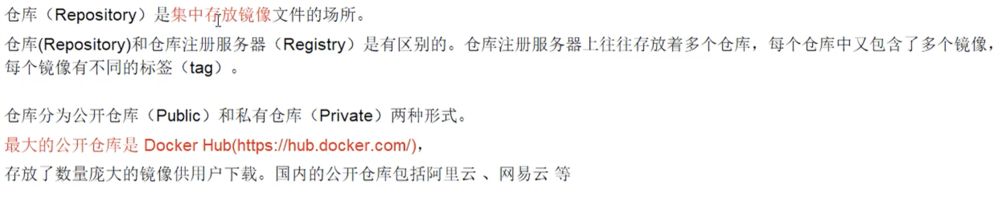
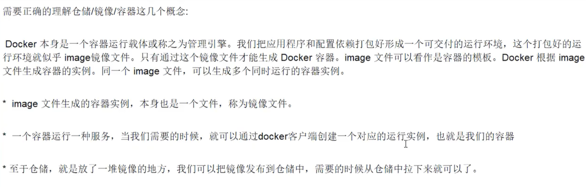
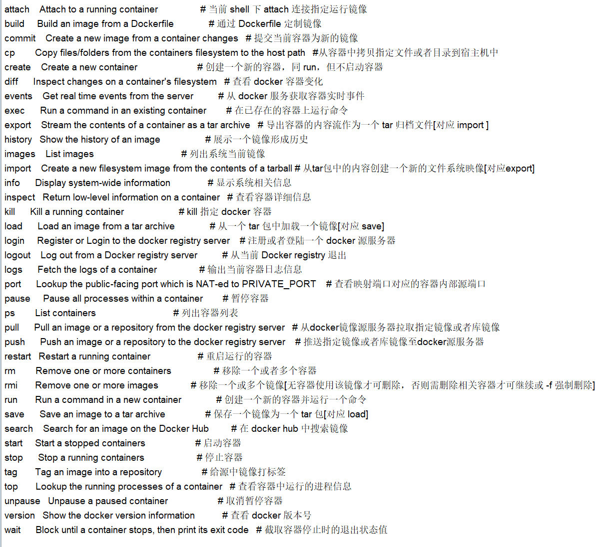
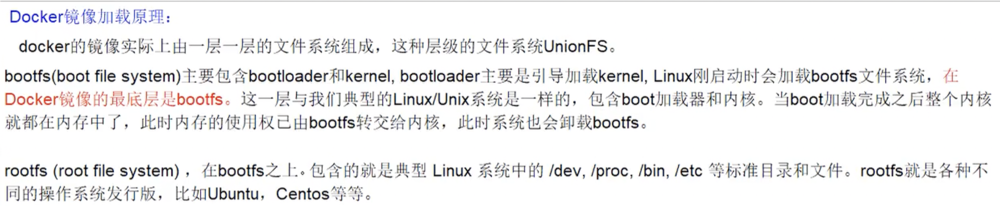
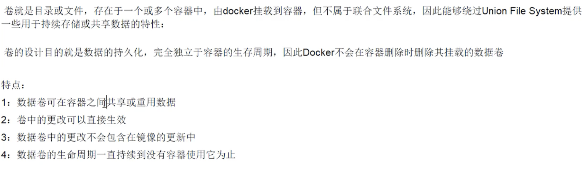

# docker

镜像 -> 类

容器 -> 对象

仓库 -> 集中存放镜像

Docker 利用容器独立运行一个或一组应用，容器是用镜像创建的运行实例。它可以被启动、开始、停止、删除。每个容器都是相互隔离的、保证安全的平台。可以把容器看做是一个简易版的Linux环境（包括root用户权限、进程空间、用户空间和网络空间等）和运行在其中的应用程序。容器的定义和镜像几乎一模一样，也是一堆层的统一视角，唯一区别在于容器的最上面那一层是可读可写的。





## Docker命令

### 帮助命令

```docker
docker version
docker --version
docker info
docker --help
```

### 镜像命令

```docker
docker images							列出本地所有的镜像
docker images -a					列出本地所有的镜像（包括中间映像层）
docker images -q					只显示镜像ID
docker images -qa					显示所有镜像ID
docker images --digests		显示镜像的摘要信息
docker --no-trunc					显示完整信息

docker search	$镜像名
docker search --filter=stars=30 hadoop  stars>30的

docker pull $镜像名

docker rmi $镜像名   			删除镜像
docker rmi -f $镜像名			强制删除
docker rmi -f $镜像名1 $镜像名2
docker rmi -f $(docker images -qa) 删除子命令得到的images（这个$是不省略的）
```

### 容器命令

```docker
docker run [OPTIONS] IMAGE [COMMAND] [ARG]    新建并启动容器
OPTIONS：
		--name="容器新名字"		 为容器指定一个名称；
		-d										后台运行容器，并返回容器ID，即启动守护式容器(daemon)
		-i										以交互模式运行容器，通常与-t同时使用(interactive)
		-t										为容器重新分配一个伪输入终端，通常与-i同时使用
		-P										随机端口映射
		-p										指定端口映射，有一下四种格式
				ip:hostPort:containerPort
				ip::containerPort
				hostPort:containerPort
				containerPort
```

```docker
docker ps [OPTIONS]   		列出当前所有正在运行的容器
		-a：列出当前所有正在运行的容器+历史上运行过的
		-l:显示最近创建的容器
		-n $数字：显示最近n个创建的容器
		-q：静默模式，只显示容器编号
		--no-trunc：不截断输出
```

```docker
control +PQ 容器不停止退出
exit 退出并关闭it模式的docker实例
```

```docker
docker start 容器名或容器ID       启动容器
docker restart 容器名或容器ID			重启容器
docker stop 容器名或容器ID				停止容器
docker kill 容器名或容器ID				强行停止容器
docker rm 容器名或容器ID					删除容器
docker rm -f 容器名或容器ID				强行删除容器
docker rm -f $(docker ps -aq)		一次删除多个容器
docker ps -a -q | xargs docker rm	一次删除多个容器   xargs 可变参数  上一个命令的结果作为下一个命令的输入
```

docker 以后台运行而没有前台窗口时，会自杀

```docker
docker run -d $镜像名 								 后台运行而没有前台窗口时，会自杀
docker run -d $镜像名 /bin/sh -c "while true; do echo hello zzyy; sleep 2; done" 前台仍有任务，后台不会自杀
docker logs -f -t --tail $容器ID			查看容器日志  -t时间戳 -f跟随最新的日志打印 --tail数字 显示最后多少条
docker top $容器ID 										查看容器内运行的进程
docker inspect $容器ID								查看容器内部细节

docker exec -t $容器ID ls -l /tmp 		还在原来的命令行不进入容器执行指定命令
docker attach $容器ID									直接进入容器启动的终端，不会启动新的进程

docker exec -t $容器ID /bin/bash			进入了新的终端，但是这样打开会出现bug，无法执行命令
docker exec -it $容器ID /bin/bash 		这样才没有bug

docker cp $容器ID:容器内路径 目的主机路径 拷贝 也可以反向拷贝  交换顺序即可

```



## docker镜像

UnionFS(联合文件系统)：一种分层、轻量级并且高性能的文件系统，支持**文件系统的修改作为一次提交来一层层的叠加**，同是可以将不同目录挂载到同一个虚拟文件系统下。Union文件系统是Docker镜像的基础。镜像可以通过分层来进行继承，基于基础镜像（没有父镜像），可以制作各种具体的应用镜像。

特性：一次同时加载多个文件系统，但从外面看起来，只能看到一个文件系统，联合加载会把各层文件系统叠加起来，这样最终的文件系统会包含所有底层的文件和目录。



对于一个精简的OS，rootfs可以很小，只需要包括最基本的命令、工具和程序库即可，因为底层直接用宿主机的内核，自己只需要提供rootfs就行了。由此可见对于不同的linux发行版，bootfs基本是一致的，rootfs会有差别，因此不同的发行版可以公用rootfs。

**Docker镜像为什么采用分层结构？**

最大的好处--共享资源。比如有多个镜像都从相同的base镜像构建而来，那么宿主机只需要在磁盘上保存一份base镜像，同时内存中也只需加载一份base镜像，就可以为所有容器服务了。而且镜像的每一层都可以被共享。

```docker
docker commit 		提交容器副本使之成为一个新的镜像
docker commit -m="提交的描述信息" -a="作者" 容器ID 要创建的目标镜像名:[标签名]

docker run -it -p 主机端口：docker容器端口 容器ID   					自定义端口映射
docker run -it -P 容器ID																	随机分配端口
```

## Docker 容器数据卷

持久化



添加方式：

- 直接命令添加
- DockerFile添加

### 直接命令添加

```docker
docker run -it -v /宿主机绝对路径目录：/容器内目录 镜像名

docker run -it -v /宿主机绝对路径目录：/容器内目录:ro 镜像名		带只读权限

docker inspect $容器ID 		查看描述容器的json串信息
```

### DockerFIle添加

```docker
是对docker images的描述代码
```

```dockerfile
# 根目录下新建mydocker文件夹并进入，不指定host文件夹，为了保证可迁移性
FROM centos
VOLUME ["/dataVolumeContainer1","/dataVolumeContainer2"]
CMD echo "finished,--------success1"  #mac中可能不是CMD 但是仍可成功创建数据卷
CMD /bin/bash
```

```shell
docker build -f $Dockerfile文件位置 -t $新镜像名 .       新建镜像，注意后面有个空格点
这时候只能在当前文件夹下进行操作，可能和后面的点有关

主机内的数据卷由docker默认给，用docker inspect查看位置
mac和windows下的Docker会创建一个VM，inspect出来的宿主机目录在这个VM下，直接在mac找找不到

*********这里待解决
```

### 数据卷容器

命名的容器挂载数据卷，其它容器通过挂载这个（父容器）实现数据共享，挂载数据卷的容器，称之为数据卷容器

```shell
docker rename $原名称 $新名称          容器改名
docker run -it --name dc02 --volumes-from dc01 ogleede/centos     继承创建
```

**容器之间的配置信息的传递，数据卷的生命周期一直持续到没有容器使用它为止。类似于指向同一块内存区域，删除了模板数据卷后仍然可以实现数据传递与共享**


## Dockerfile

Dockerfile是用来构建Docker镜像的构建文件，是由一系列命令和参数构成的脚本。

**Dockerfile基础内容**

- 每条保留字指令都必须为大写且后面要跟随至少一个参数
- 指令按照从上到下，顺序执行
- #表示注释
- 每条指令都会创建一个新的镜像层，并对镜像进行提交

**Docker执行Dockerfile的大致流程**

- docker从基础镜像运行一个容器
- 执行一条指令并对容器作出修改
- 执行类似docker commit的操作提交一个新的镜像层
- docker再基于刚提交的镜像运行一个新容器
- 执行dockerfile中的下一条指令知道所有指令都执行完成


# Docker 网络

## docker0


**mac中 容器之间可以互相ping通，容器可以ping通mac，但是mac无法ping通容器**

```shell
docker network ls
docker network inspect $netid
# --link  相当于在host里面 放入了映射

docker run -d -P --name hadoop101 --net $网络名 $镜像名
docker network create --driver bridge --subnet 192.168.0.0/16 --gateway 192.168.0.1 mynet
# 自定义网络支持容器名映射

# 打通不同网段
docker network connect $network $container  将不同网段的容器加到新的网段
# 一个容器两个ip，就像阿里云服务器有两个ip，一个公网ip，一个私网ip

docker network ls
docker network inspect $网络名
docker run -itd -p 18023:22 --privileged --name hadoop3 --hostname hadoop3 -
-network hadoop-br --ip 192.168.0.4 mycentos /usr/sbin/init

systemctl start sshd.service

```


# 搭建hadoop集群问题

> docker for mac 无法直接ping通容器
>
> 使用默认bridge的容器可以访问外网
>
> 使用自定义bridge网络的容器不可以访问外网，可以ping通mac，mac不能ping通容器

https://www.cnblogs.com/zcqkk/p/13608811.html

 按照上面的进行配置，并且在-run 添加--hostname更改主机名映射


>  采用默认bridge网络构建的虚拟机集群，无法通过更改static固定ip。只能通过打开集群的顺序来决定特定集群的ip地址。
>
> 如果采用这种方法，无法固定ip，但是容器可以访问外网。
>
> 采用自定义bridge网络，可以固定ip，但是容器我还找不到方法去访问外网，


> 利用ssh和tranmit可以实现文件和指令互通，不用特别去考虑外部网络的问题！！！！！
>
> 


> JDK版本要选择arch64版本！！！

```shell
scp -r $user@$hostname:$fileaddress $user@$hostname:$fileaddress
# 先输入位置  再输出位置
```


**固定ip无法访问外网实在是不方便，决定启用默认桥接网络，然后根据docker容器顺序来固定ip的做法**

--add-host hadoop1:192.168.10.31 --add-host hadoop2:192.168.10.32
